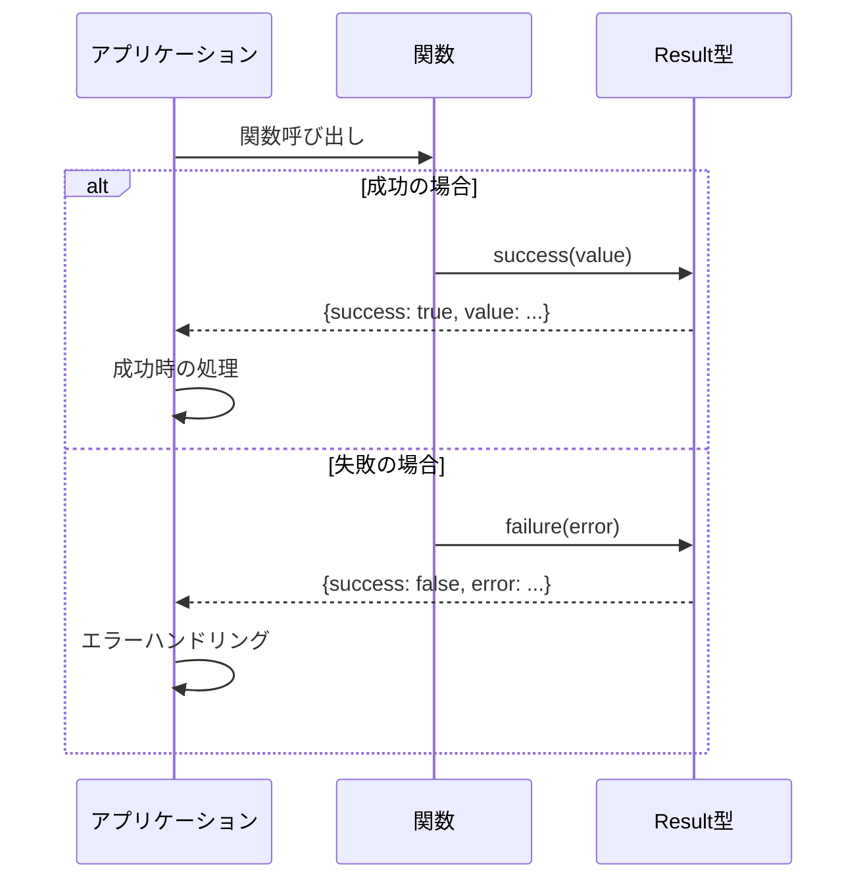
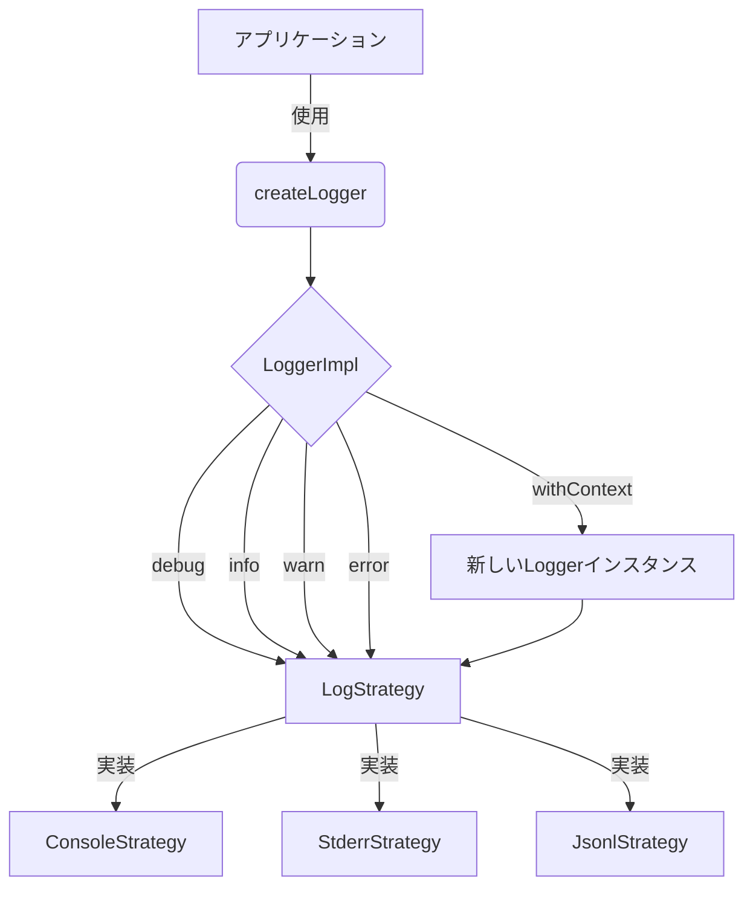
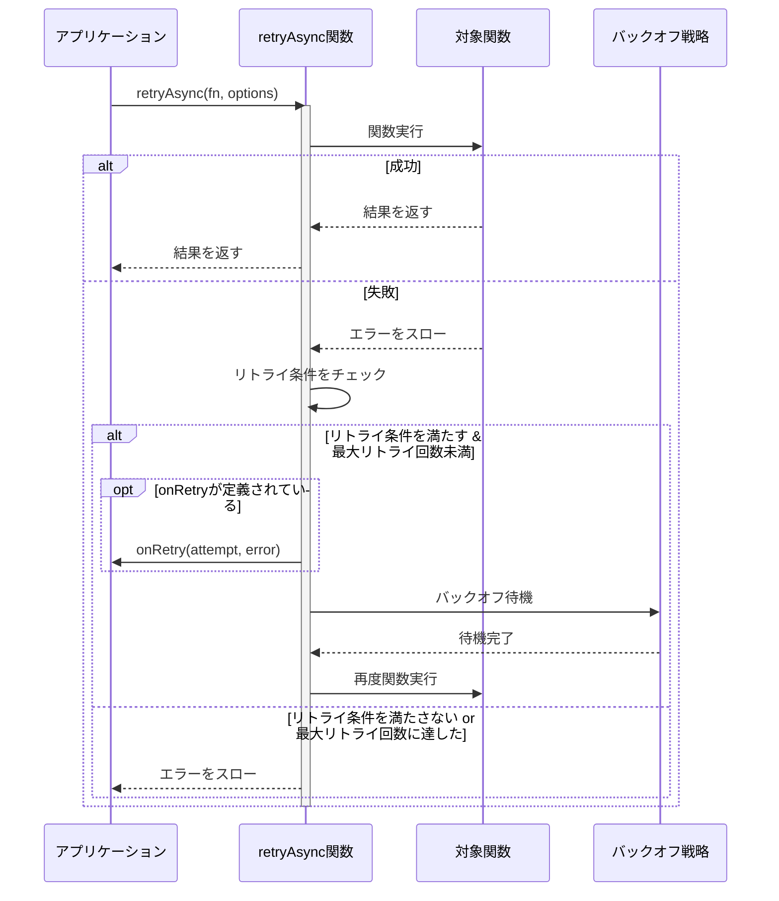
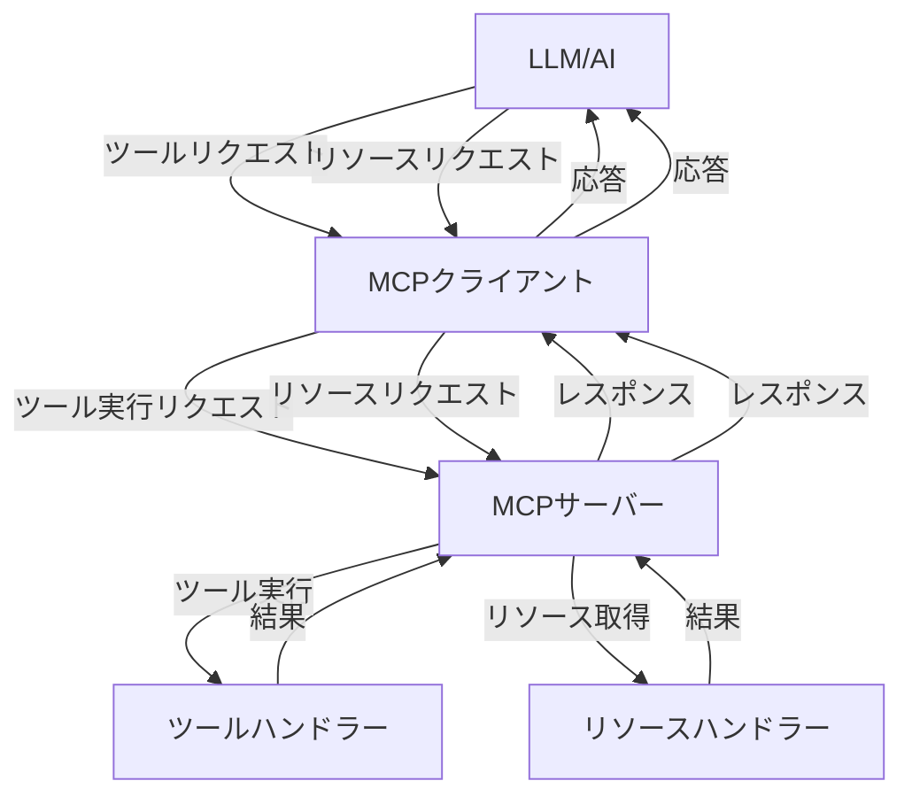

# libca API ドキュメント

## 目次

- [イントロダクション](#イントロダクション)
- [Result モジュール](#result-モジュール)
  - [概要](#result-概要)
  - [型定義](#result-型定義)
  - [ユーティリティ関数](#result-ユーティリティ関数)
  - [エラータイプ](#result-エラータイプ)
  - [使用例](#result-使用例)
- [Logger モジュール](#logger-モジュール)
  - [概要](#logger-概要)
  - [型定義](#logger-型定義)
  - [コア機能](#logger-コア機能)
  - [出力戦略](#logger-出力戦略)
  - [使用例](#logger-使用例)
- [Retry モジュール](#retry-モジュール)
  - [概要](#retry-概要)
  - [型定義](#retry-型定義)
  - [バックオフ関数](#retry-バックオフ関数)
  - [リトライ関数](#retry-リトライ関数)
  - [使用例](#retry-使用例)
- [MCP モジュール](#mcp-モジュール)
  - [概要](#mcp-概要)
  - [型定義](#mcp-型定義)
  - [サーバー機能](#mcp-サーバー機能)
  - [クライアント機能](#mcp-クライアント機能)
  - [使用例](#mcp-使用例)
- [Fetch モジュール](#fetch-モジュール)
  - [概要](#fetch-概要)
  - [型定義](#fetch-型定義)
  - [基本クライアント](#fetch-基本クライアント)
  - [JSON クライアント](#fetch-json-クライアント)
  - [ストリーミングクライアント](#fetch-ストリーミングクライアント)
  - [使用例](#fetch-使用例)

## イントロダクション

libcaは、汎用的なTypeScriptライブラリ集です。単一責任の原則に従い、各モジュールが明確な責務を持つように設計されています。インターフェースベースの設計により、将来的な実装の変更や拡張に対応可能です。最小限の依存関係を維持し、メンテナンス性を高めることを目指しています。

本ドキュメントでは、libcaが提供する各モジュールのAPI詳細を解説します。

---

## Result モジュール

<a id="result-概要"></a>
### 概要

Result モジュールは、例外を使わずに成功・失敗を表現するための型と操作関数を提供します。Result型を使うことで、関数が失敗する可能性を型情報として表現し、コンパイル時に適切なエラーハンドリングを強制することができます。

<a id="result-型定義"></a>
### 型定義

#### `Result<T, E>`

成功または失敗を表す共用型です。

```typescript
export type Result<T, E> = Success<T> | Failure<E>;
```

#### `Success<T>`

成功を表す型です。

```typescript
export interface Success<T> {
  success: true;
  value: T;
}
```

#### `Failure<E>`

失敗を表す型です。

```typescript
export interface Failure<E> {
  success: false;
  error: E;
}
```

#### `ErrorInfoBase`

エラー情報の基本インターフェースです。

```typescript
export interface ErrorInfoBase {
  message: string;
  recoverable: boolean;
  cause?: Error | undefined;
  stack?: string | undefined;
}
```

#### `ErrorInfo<TType, TCode, TExtra>`

拡張可能なエラー情報型です。

```typescript
export type ErrorInfo<
  TType extends string,
  TCode extends string,
  TExtra = Record<string, unknown>
> = ErrorInfoBase & {
  type: TType;
  code: TCode;
} & TExtra;
```

#### `GeneralErrorInfo`

一般的なエラー情報型です。

```typescript
export type GeneralErrorInfo = ErrorInfo<string, string>;
```

<a id="result-ユーティリティ関数"></a>
### ユーティリティ関数

#### 型ガード関数

- **`isSuccess<T, E>(result: Result<T, E>): result is Success<T>`**  
  Resultが成功かどうかをチェックする型ガードです。
  
- **`isFailure<T, E>(result: Result<T, E>): result is Failure<E>`**  
  Resultが失敗かどうかをチェックする型ガードです。

#### 結果作成関数

- **`success<T>(value: T): Success<T>`**  
  成功のResultを作成します。
  
- **`failure<E>(error: E): Failure<E>`**  
  失敗のResultを作成します。

#### 値取得関数

- **`unwrap<T, E>(result: Result<T, E>, fallback: T): T`**  
  Resultから値を取り出します。失敗の場合はフォールバック値を返します。
  
- **`unwrapOrThrow<T, E>(result: Result<T, E>, errorTransformer?: (error: E) => Error): T`**  
  Resultから値を取り出します。失敗の場合は例外をスローします。

#### 変換関数

- **`map<T, U, E>(result: Result<T, E>, fn: (value: T) => U): Result<U, E>`**  
  Result内の値を変換します。
  
- **`flatMap<T, U, E>(result: Result<T, E>, fn: (value: T) => Result<U, E>): Result<U, E>`**  
  Result内の値を別のResultに変換します。
  
- **`mapError<T, E, F>(result: Result<T, E>, fn: (error: E) => F): Result<T, F>`**  
  Result内のエラーを変換します。

#### 非同期関数

- **`mapAsync<T, U, E>(result: Result<T, E>, fn: (value: T) => Promise<U>): Promise<Result<U, E>>`**  
  Result内の値を非同期に変換します。
  
- **`flatMapAsync<T, U, E>(result: Result<T, E>, fn: (value: T) => Promise<Result<U, E>>): Promise<Result<U, E>>`**  
  Result内の値を非同期に別のResultに変換します。
  
- **`tryAsync<T, Args extends unknown[]>(fn: (...args: Args) => Promise<T>, ...args: Args): Promise<Result<T, Error>>`**  
  非同期関数の実行結果をResultでラップします。

#### その他の関数

- **`all<T, E>(results: Result<T, E>[]): Result<T[], E>`**  
  複数のResultを結合します。すべて成功した場合は値の配列、一つでも失敗した場合は最初の失敗を返します。

<a id="result-エラータイプ"></a>
### エラータイプ

Result モジュールは、様々なタイプのエラーを作成するユーティリティ関数を提供します：

- **`createValidationError(message: string, field?: string): ValidationErrorInfo`**  
  バリデーションエラーを作成します。
  
- **`createSystemError(message: string, code?: string): SystemErrorInfo`**  
  システムエラーを作成します。
  
- **`createNetworkError(message: string, url?: string): NetworkErrorInfo`**  
  ネットワークエラーを作成します。
  
- **`createHttpError(message: string, statusCode: number, url?: string): HttpErrorInfo`**  
  HTTPエラーを作成します。
  
- **`createDatabaseError(message: string, operation?: string, table?: string): DatabaseErrorInfo`**  
  データベースエラーを作成します。
  
- **`createIOError(message: string, path?: string, operation?: string): IOErrorInfo`**  
  I/Oエラーを作成します。

<a id="result-使用例"></a>
### 使用例

```typescript
import { success, failure, isSuccess, unwrap, createSystemError } from "libca";

// 成功の例
const successResult = success("Hello via Bun!");
console.log("Success result:", successResult);
console.log("Is success?", isSuccess(successResult));
console.log("Value:", unwrap(successResult, "Default value"));

// 失敗の例
const errorInfo = createSystemError("Something went wrong");
const failureResult = failure(errorInfo);
console.log("Failure result:", failureResult);
console.log("Is success?", isSuccess(failureResult));
console.log("Value with fallback:", unwrap(failureResult, "Default value"));
```

#### Result を返す関数の例

```typescript
import { Result, success, failure, createValidationError } from "libca";

function divide(a: number, b: number): Result<number, ErrorInfoBase> {
  if (b === 0) {
    return failure(createValidationError("除数に0を指定することはできません", "b"));
  }
  return success(a / b);
}
```

#### 非同期関数との連携

```typescript
import { tryAsync, isSuccess, unwrapOrThrow } from "libca";

async function fetchData(url: string): Promise<string> {
  const response = await fetch(url);
  if (!response.ok) {
    throw new Error(`HTTP error! status: ${response.status}`);
  }
  return await response.text();
}

// tryAsync を使ってエラーハンドリングを簡素化
const result = await tryAsync(fetchData, "https://example.com/api");
if (isSuccess(result)) {
  console.log("Data:", result.value);
} else {
  console.error("Error:", result.error.message);
}

// unwrapOrThrow でエラーの場合に例外を投げることも可能
try {
  const data = unwrapOrThrow(result);
  console.log("Data:", data);
} catch (error) {
  console.error("Caught error:", error);
}
```

#### シーケンス図: Result型を使ったエラーハンドリング



---

## Logger モジュール

<a id="logger-概要"></a>
### 概要

Logger モジュールは、拡張性のあるログ出力機能を提供します。様々な出力戦略（コンソール、標準エラー、JSONL形式）をサポートし、実行環境（ブラウザ/Node.js/Bun）に応じた最適なデフォルト戦略を自動選択します。また、MCPサーバーとの互換性を考慮し、stdout汚染を避ける設計になっています。

<a id="logger-型定義"></a>
### 型定義

#### `LogLevel`

ログレベルを表す型です。

```typescript
export type LogLevel = 'debug' | 'info' | 'warn' | 'error';
```

#### `LOG_LEVEL_PRIORITY`

ログ出力の優先順位を定義します。数値が大きいほど優先度が高くなります。

```typescript
export const LOG_LEVEL_PRIORITY: Record<LogLevel, number> = {
  debug: 0,
  info: 1,
  warn: 2,
  error: 3,
};
```

#### `LogStrategy`

ログ出力戦略のインターフェースです。

```typescript
export interface LogStrategy {
  log(level: LogLevel, ...args: unknown[]): void;
}
```

#### `Logger`

ロガーのインターフェースです。

```typescript
export interface Logger {
  debug(...args: unknown[]): void;
  info(...args: unknown[]): void;
  warn(...args: unknown[]): void;
  error(...args: unknown[]): void;
  withContext(context: string): Logger;
}
```

#### `LoggerOptions`

ロガー作成のオプションです。

```typescript
export interface LoggerOptions {
  strategy?: LogStrategy;
  minLevel?: LogLevel;
  defaultContext?: string;
}
```

#### `JsonlStrategyOptions`

JSONL形式出力戦略のオプションです。

```typescript
export interface JsonlStrategyOptions {
  destination: 'stdout' | 'stderr' | string;
  formatOptions?: {
    includeTimestamp?: boolean;
    maxDepth?: number;
    maxArrayLength?: number;
  };
}
```

<a id="logger-コア機能"></a>
### コア機能

#### `createLogger(options?: LoggerOptions): Logger`

ロガーを作成する関数です。オプションが指定されない場合は、実行環境に適したデフォルトのストラテジーを使用します。

```typescript
// デフォルトロガーを作成
const logger = createLogger();

// オプション付きのロガーを作成
const customLogger = createLogger({
  minLevel: 'info',
  defaultContext: 'App'
});
```

#### ロガーの基本的な使い方

```typescript
// 様々なレベルでログを出力
logger.debug("デバッグ情報");
logger.info("情報メッセージ");
logger.warn("警告メッセージ");
logger.error("エラーメッセージ");

// オブジェクトや複数の引数も指定可能
logger.info("ユーザー情報:", { id: 1, name: "山田太郎" });
```

#### コンテキスト付きロガー

```typescript
// "Database"というコンテキストを持つ新しいロガーを作成
const dbLogger = logger.withContext("Database");
dbLogger.info("接続が確立されました"); // ログ出力: [Database] 接続が確立されました
```

<a id="logger-出力戦略"></a>
### 出力戦略

#### `createConsoleStrategy()`

コンソールを使用するログ出力戦略を作成します。ブラウザ環境向けです。

```typescript
import { createLogger, createConsoleStrategy } from "libca";

const logger = createLogger({
  strategy: createConsoleStrategy()
});
```

#### `createStderrStrategy()`

標準エラー出力を使用するログ出力戦略を作成します。Node.js/Bun環境向けです。

```typescript
import { createLogger, createStderrStrategy } from "libca";

const logger = createLogger({
  strategy: createStderrStrategy()
});
```

#### `createJsonlStrategy(options: JsonlStrategyOptions)`

JSONL形式でログを出力する戦略を作成します。ファイルやストリームへの出力に適しています。

```typescript
import { createLogger, createJsonlStrategy } from "libca";

const logger = createLogger({
  strategy: createJsonlStrategy({
    destination: "app.log",
    formatOptions: {
      includeTimestamp: true
    }
  })
});
```

<a id="logger-使用例"></a>
### 使用例

#### 基本的な使用方法

```typescript
import { createLogger } from "libca";

// デフォルトロガーを作成
const logger = createLogger();

// アプリケーションの起動をログに記録
logger.info("アプリケーションが起動しました");

// 警告の記録
logger.warn("デバイスの応答が遅いです");

// エラーの記録
try {
  // 何らかの処理
} catch (error) {
  logger.error("エラーが発生しました", error);
}
```

#### コンテキスト付きロガーの使用

```typescript
import { createLogger } from "libca";

// ベースロガーを作成
const logger = createLogger();

// ドメイン特有のロガーを作成
const authLogger = logger.withContext("Auth");
const dbLogger = logger.withContext("Database");
const apiLogger = logger.withContext("API");

// 各コンテキストでログを記録
authLogger.info("ユーザー認証に成功しました");
dbLogger.error("データベース接続に失敗しました");
apiLogger.debug("APIリクエスト", { url: "/users", method: "GET" });
```

#### カスタム出力戦略の使用

```typescript
import { createLogger, createJsonlStrategy } from "libca";

// ファイルに出力するJSONLロガーを作成
const fileLogger = createLogger({
  strategy: createJsonlStrategy({
    destination: "logs/app.log",
    formatOptions: {
      includeTimestamp: true,
      maxDepth: 3
    }
  }),
  minLevel: "info" // info以上のレベルのみ記録
});

fileLogger.info("アプリケーションイベント", { user: { id: 1, name: "田中" }, action: "login" });
```

#### フロー図: Loggerの機能と関係



---

## Retry モジュール

<a id="retry-概要"></a>
### 概要

Retry モジュールは、失敗した操作を設定可能なバックオフ戦略で再試行するための機能を提供します。通常の関数とResult型を返す関数の両方をサポートし、様々なリトライシナリオに対応します。

<a id="retry-型定義"></a>
### 型定義

#### `BackoffOptions`

バックオフに関連するオプションです。

```typescript
export interface BackoffOptions {
  baseMs?: number;       // ベース時間（ミリ秒）
  maxMs?: number;        // 最大待機時間（ミリ秒）
  jitterFactor?: number; // ジッター係数（0～1）
}
```

#### `BackoffFunction`

バックオフ関数の型です。

```typescript
export type BackoffFunction = (attempt: number) => Promise<void>;
```

#### `RetryCondition`

リトライ条件の型です。

```typescript
export type RetryCondition<E = unknown> = (error: E, attempt: number) => boolean;
```

#### `RetryOptions`

通常のリトライ用オプションです。

```typescript
export interface RetryOptions<E = unknown> {
  maxRetries: number;                         // 最大リトライ回数
  backoff?: BackoffFunction;                  // バックオフ関数
  retryCondition?: RetryCondition<E>;         // リトライ条件
  onRetry?: (attempt: number, error: E) => void; // リトライ前コールバック
}
```

#### `RetryResultOptions`

Result型リトライ用のオプションです。

```typescript
export interface RetryResultOptions<E> extends RetryOptions<E> {
  // Result型特有のオプションがあれば追加
}
```

<a id="retry-バックオフ関数"></a>
### バックオフ関数

#### `exponentialBackoffWithJitter(options?: BackoffOptions): BackoffFunction`

指数バックオフとジッターを組み合わせたバックオフ戦略を提供します。

```typescript
// デフォルトオプションでのバックオフ関数
const backoff = exponentialBackoffWithJitter();

// カスタムオプションでのバックオフ関数
const customBackoff = exponentialBackoffWithJitter({
  baseMs: 100,         // ベース時間を100ミリ秒に設定
  maxMs: 10000,        // 最大待機時間を10秒に設定
  jitterFactor: 0.3    // ジッター係数を30%に設定
});
```

#### `exponentialBackoff(baseMs = 200): BackoffFunction`

ジッターなしの指数バックオフ戦略を提供します。

```typescript
// デフォルトのベース時間200ミリ秒でバックオフ関数を作成
const backoff = exponentialBackoff();

// ベース時間100ミリ秒でバックオフ関数を作成
const customBackoff = exponentialBackoff(100);
```

#### `createBackoff(options?: BackoffOptions): BackoffFunction`

バックオフ関数を作成します。内部的には`exponentialBackoffWithJitter`を使用します。

```typescript
const backoff = createBackoff({
  baseMs: 200,
  maxMs: 5000,
  jitterFactor: 0.2
});
```

<a id="retry-リトライ関数"></a>
### リトライ関数

#### `retry<T, E = Error>(fn: () => T, options: RetryOptions<E>): Promise<T>`

同期関数をリトライします。内部的には関数を非同期関数としてラップし、`retryAsync`を使用します。

```typescript
const result = await retry(
  () => {
    // 同期的な処理
    if (Math.random() < 0.5) throw new Error("ランダムエラー");
    return "成功!";
  },
  { maxRetries: 3 }
);
```

#### `retryAsync<T, E = Error>(fn: () => Promise<T>, options: RetryOptions<E>): Promise<T>`

非同期関数をリトライします。

```typescript
const result = await retryAsync(
  async () => {
    // 非同期処理
    const response = await fetch("https://api.example.com");
    if (!response.ok) throw new Error(`HTTP error! status: ${response.status}`);
    return await response.json();
  },
  {
    maxRetries: 5,
    backoff: exponentialBackoffWithJitter({ baseMs: 500 }),
    onRetry: (attempt, error) => console.log(`リトライ ${attempt}: ${error.message}`)
  }
);
```

#### `retryResult<T, E extends AnyErrorInfo>(fn: () => Promise<Result<T, E>>, options: RetryOptions<E>): Promise<Result<T, E>>`

Result型を返す非同期関数をリトライします。失敗かつエラーが回復可能（`error.recoverable === true`）な場合のみリトライします。

```typescript
import { failure, success, createSystemError, retryResult } from "libca";

const result = await retryResult(
  async () => {
    // Result型を返す非同期処理
    try {
      const response = await fetch("https://api.example.com");
      if (!response.ok) {
        const error = createSystemError(`HTTP error! status: ${response.status}`);
        error.recoverable = response.status >= 500; // 500番台のエラーは回復可能と判断
        return failure(error);
      }
      return success(await response.json());
    } catch (error) {
      return failure(createSystemError("ネットワークエラー", { recoverable: true }));
    }
  },
  {
    maxRetries: 3,
    onRetry: (attempt, error) => console.log(`リトライ ${attempt}: ${error.message}`)
  }
);
```

<a id="retry-使用例"></a>
### 使用例

#### 通常関数のリトライ

```typescript
import { retry, retryAsync, createBackoff } from "libca";

// 同期関数のリトライ
try {
  const result = await retry(
    () => {
      if (Math.random() < 0.7) throw new Error("一時的なエラー");
      return "処理成功";
    },
    {
      maxRetries: 5,
      backoff: createBackoff({ baseMs: 200, maxMs: 2000 }),
      retryCondition: (error, attempt) => error.message.includes("一時的"),
      onRetry: (attempt, error) => console.log(`試行 ${attempt} 失敗: ${error.message}`)
    }
  );
  console.log("最終結果:", result);
} catch (error) {
  console.error("すべての試行が失敗:", error.message);
}

// 非同期関数のリトライ
const fetchWithRetry = async (url: string) => {
  return await retryAsync(
    async () => {
      const response = await fetch(url);
      if (!response.ok) throw new Error(`HTTP status ${response.status}`);
      return await response.json();
    },
    {
      maxRetries: 3,
      // 5xx エラーのみリトライ
      retryCondition: (error) => 
        error instanceof Error && 
        error.message.includes("HTTP status 5")
    }
  );
};
```

#### Result型関数のリトライ

```typescript
import { retryResult, success, failure, createSystemError, isSuccess } from "libca";

async function fetchData(url: string) {
  // Result型を返す関数
  const result = await retryResult(
    async () => {
      try {
        const response = await fetch(url);
        if (!response.ok) {
          const error = createSystemError(`HTTPエラー: ${response.status}`);
          // サーバーエラー(5xx)は回復可能として扱う
          error.recoverable = response.status >= 500;
          return failure(error);
        }
        return success(await response.json());
      } catch (error) {
        const networkError = createSystemError("ネットワークエラー");
        networkError.recoverable = true; // ネットワークエラーは回復可能
        return failure(networkError);
      }
    },
    {
      maxRetries: 5,
      backoff: exponentialBackoffWithJitter({ baseMs: 500, maxMs: 10000 }),
      onRetry: (attempt, error) => {
        console.log(`データ取得リトライ(${attempt}): ${error.message}`);
      }
    }
  );
  
  return result;
}

// 使用例
const result = await fetchData("https://api.example.com/data");
if (isSuccess(result)) {
  console.log("データ取得成功:", result.value);
} else {
  console.error("データ取得失敗:", result.error.message);
}
```

#### シーケンス図: リトライ処理フロー



---

## MCP モジュール

<a id="mcp-概要"></a>
### 概要

MCP（Model Context Protocol）モジュールは、大規模言語モデルとのコンテキスト共有を実現するプロトコルの実装を提供します。このモジュールには、MCPサーバーの作成・設定・実行機能、ツール、リソース、プロンプトの定義と管理、クライアント接続管理とツール実行、エラーハンドリングとロギング連携機能が含まれます。

<a id="mcp-型定義"></a>
### 型定義

#### サーバー関連の型

```typescript
export interface McpServerConfig {
  name: string;
  version: string;
  description?: string;
}

export interface McpServer {
  run(transport: 'stdio' | 'sse'): Promise<Result<void, McpErrorInfo>>;
  addTool(name: string, definition: ToolDefinition): void;
  addResource(uri: string, definition: ResourceDefinition): void;
  addPrompt(name: string, definition: PromptDefinition): void;
}

export interface ToolDefinition {
  description: string;
  inputSchema: z.ZodObject<z.ZodRawShape>;
  handler: ToolHandler;
}

export interface ResourceDefinition {
  description: string;
  handler: ResourceHandler;
}

export interface PromptDefinition {
  description: string;
  template: string;
  paramSchema?: z.ZodObject<z.ZodRawShape>;
}
```

#### クライアント関連の型

```typescript
export interface McpClient {
  // クライアント関連のメソッド
}

export interface McpClientConfig {
  // クライアント設定
}

export type ConnectionStatus = 'connected' | 'disconnected' | 'error';
export type ConnectionType = 'stdio' | 'sse';

export interface ConnectionInfo {
  id: string;
  type: ConnectionType;
  status: ConnectionStatus;
  serverInfo?: {
    name: string;
    version: string;
    description?: string;
  };
}
```

#### リクエスト/レスポンス関連の型

```typescript
export interface ToolRequest {
  name: string;
  arguments: Record<string, unknown>;
}

export interface ToolResponse {
  content: ToolResponseContent[];
}

export type ToolResponseContent = TextContent | ImageContent;

export interface TextContent {
  type: 'text';
  text: string;
  [key: string]: unknown;
}

export interface ImageContent {
  type: 'image';
  data: string;
  mimeType: string;
  [key: string]: unknown;
}

export interface ResourceResponse {
  content: unknown;
}
```

#### エラー関連の型

```typescript
export type McpErrorKind =
  | 'connection'
  | 'communication'
  | 'timeout'
  | 'parsing'
  | 'validation'
  | 'execution';

export interface McpErrorInfo extends ErrorInfoBase {
  type: 'mcp';
  kind: McpErrorKind;
  recoverable: boolean;
}
```

<a id="mcp-サーバー機能"></a>
### サーバー機能

#### `createMcpServer(config: McpServerConfig): McpServer`

MCPサーバーを作成します。

```typescript
import { createMcpServer } from "libca";

const server = createMcpServer({
  name: "weather-server",
  version: "1.0.0",
  description: "天気情報を提供するMCPサーバー"
});
```

#### ツールの追加

```typescript
import { z } from "zod";
import { createMcpServer, createSimpleTextResponse, success } from "libca";

const server = createMcpServer({
  name: "calculator",
  version: "1.0.0",
  description: "数学計算ツールを提供するサーバー"
});

// 計算ツールの追加
server.addTool("add", {
  description: "2つの数値を足し算します",
  inputSchema: z.object({
    a: z.number(),
    b: z.number()
  }),
  handler: async (request) => {
    const { a, b } = request.arguments as { a: number, b: number };
    const result = a + b;
    return success(createSimpleTextResponse(`${a} + ${b} = ${result}`));
  }
});
```

#### リソースの追加

```typescript
import { createMcpServer, success, createSimpleTextResponse } from "libca";

const server = createMcpServer({
  name: "file-server",
  version: "1.0.0"
});

// ファイルリソースの追加
server.addResource("file://sample.txt", {
  description: "サンプルテキストファイル",
  handler: async () => {
    // ファイルの内容を返す実装
    return success({ content: "これはサンプルファイルの内容です。" });
  }
});
```

#### サーバーの実行

```typescript
// stdioモードでサーバーを実行
const result = await server.run("stdio");

// または SSE モードで実行
// const result = await server.run("sse");
```

<a id="mcp-クライアント機能"></a>
### クライアント機能

#### `createMcpClient(config?: McpClientConfig): McpClient`

MCPクライアントを作成します。

```typescript
import { createMcpClient } from "libca";

const client = createMcpClient();
```

#### プロセス管理

```typescript
import { createProcessManager } from "libca";

const processManager = createProcessManager();
const connection = await processManager.startProcess("weather-server", "path/to/server.js");
```

#### エラーハンドリング

```typescript
import { 
  createConnectionError, 
  createCommunicationError,
  createTimeoutError,
  createParsingError,
  createExecutionError,
  createMcpError
} from "libca";

// 接続エラーの作成
const connectionError = createConnectionError("サーバーに接続できません", { url: "http://localhost:8080" });

// 実行エラーの作成
const executionError = createExecutionError("ツールの実行に失敗しました", { toolName: "calculate" });
```

<a id="mcp-使用例"></a>
### 使用例

#### 簡単なMCPサーバーの作成

```typescript
import { createMcpServer, createSimpleTextResponse, success, failure, createSystemError } from "libca";
import { z } from "zod";

// 翻訳サーバーの作成
const server = createMcpServer({
  name: "translate-server",
  version: "1.0.0",
  description: "簡単な翻訳サービスを提供するMCPサーバー"
});

// 翻訳ツールの追加
server.addTool("translate", {
  description: "テキストを指定された言語に翻訳します",
  inputSchema: z.object({
    text: z.string(),
    targetLanguage: z.enum(["en", "ja", "fr", "de", "es"])
  }),
  handler: async (request) => {
    try {
      const { text, targetLanguage } = request.arguments as { 
        text: string, 
        targetLanguage: string 
      };
      
      // 実際には翻訳APIを呼び出すなどの処理
      let translatedText = "";
      
      switch(targetLanguage) {
        case "en":
          translatedText = `[英語] ${text}`;
          break;
        case "ja":
          translatedText = `[日本語] ${text}`;
          break;
        case "fr":
          translatedText = `[フランス語] ${text}`;
          break;
        case "de":
          translatedText = `[ドイツ語] ${text}`;
          break;
        case "es":
          translatedText = `[スペイン語] ${text}`;
          break;
      }
      
      return success(createSimpleTextResponse(translatedText));
    } catch (error) {
      return failure(createSystemError(`翻訳中にエラーが発生しました: ${error}`));
    }
  }
});

// サーバーの実行
async function startServer() {
  const result = await server.run("stdio");
  // エラーハンドリング
}

startServer().catch(console.error);
```

#### フロー図: MCP通信フロー



---

## Fetch モジュール

<a id="fetch-概要"></a>
### 概要

Fetch モジュールは、汎用的かつ堅牢なHTTPクライアント機能を提供します。基本的なFetchクライアント、JSONクライアント、ストリーミングクライアントの3種類のクライアントを提供し、それぞれ異なるユースケースに対応します。タイムアウト機能、リトライ機能、エラーハンドリング、レスポンスのバリデーション、ストリーミング処理などの機能をサポートしています。

<a id="fetch-型定義"></a>
### 型定義

#### `HttpMethod`

HTTPメソッドを表す型です。

```typescript
export type HttpMethod = "GET" | "POST" | "PUT" | "DELETE" | "PATCH" | "HEAD" | "OPTIONS";
```

#### `FetchClientOptions`

Fetchクライアントのオプションです。

```typescript
export interface FetchClientOptions {
  baseUrl?: string;
  headers?: Record<string, string>;
  timeout?: number;
  retry?: RetryOptions;
  logger?: Logger;
}
```

#### `RequestOptions`

リクエストオプションです。

```typescript
export interface RequestOptions {
  method?: HttpMethod;
  params?: Record<string, string | number | boolean | undefined>;
  headers?: Record<string, string>;
  body?: unknown;
  timeout?: number;
  retry?: RetryOptions;
}
```

#### `RetryOptions`

リトライオプションです。

```typescript
export interface RetryOptions {
  maxRetries: number;
  baseMs?: number;
  maxMs?: number;
  jitterFactor?: number;
  onRetry?: (attempt: number, error: FetchErrorInfo) => void;
}
```

#### `FetchErrorInfo`

Fetchエラー情報型です。

```typescript
export type FetchErrorInfo = ErrorInfo<
  "fetch",
  FetchErrorCode,
  {
    statusCode?: number;
    url: string;
    method: HttpMethod;
    response?: unknown;
    recoverable: boolean;
    cause?: Error;
  }
>;
```

#### `FetchErrorCode`

Fetchクライアントのエラーコードです。

```typescript
export type FetchErrorCode =
  | "timeout"          // タイムアウトエラー
  | "network_error"    // ネットワークエラー
  | "http_error"       // HTTPエラー
  | "parse_error"      // レスポンスのパースエラー
  | "validation_error" // バリデーションエラー
  | "fetch_error";     // その他のFetchエラー
```

#### `StreamingOptions`

ストリーミングオプションです。

```typescript
export interface StreamingOptions extends RequestOptions {
  onChunk?: (chunk: string) => void;
  onComplete?: () => void;
  onError?: (error: FetchErrorInfo) => void;
  logger?: Logger;
}
```

<a id="fetch-基本クライアント"></a>
### 基本クライアント

#### `createFetchClient(options?: FetchClientOptions): FetchClient`

基本的なFetchクライアントを作成します。

```typescript
import { createFetchClient } from "libca";

const fetchClient = createFetchClient({
  baseUrl: "https://api.example.com",
  timeout: 5000,
  headers: {
    "Content-Type": "application/json",
    "Accept": "application/json"
  }
});
```

#### 基本メソッド

```typescript
// GETリクエスト
const getResult = await fetchClient.get("/users/1");

// POSTリクエスト
const postResult = await fetchClient.post("/users", { name: "John", email: "john@example.com" });

// PUTリクエスト
const putResult = await fetchClient.put("/users/1", { name: "John Updated" });

// DELETEリクエスト
const deleteResult = await fetchClient.delete("/users/1");

// PATCHリクエスト
const patchResult = await fetchClient.patch("/users/1", { name: "John Patched" });
```

<a id="fetch-json-クライアント"></a>
### JSON クライアント

#### `createJsonClient(options?: FetchClientOptions): JsonClient`

JSONクライアントを作成します。Zodスキーマによるレスポンスのバリデーションを提供します。

```typescript
import { createJsonClient } from "libca";
import { z } from "zod";

const jsonClient = createJsonClient({
  baseUrl: "https://api.example.com"
});

// ユーザースキーマの定義
const userSchema = z.object({
  id: z.number(),
  name: z.string(),
  email: z.string().email()
});

// スキーマ付きGETリクエスト
const userResult = await jsonClient.get(userSchema, "/users/1");
```

<a id="fetch-ストリーミングクライアント"></a>
### ストリーミングクライアント

#### `createStreamingClient(options?: FetchClientOptions): StreamingClient`

ストリーミングクライアントを作成します。Server-Sent EventsやChunked Responseの処理に適しています。

```typescript
import { createStreamingClient } from "libca";

const streamingClient = createStreamingClient({
  baseUrl: "https://api.example.com"
});

// ストリーミングリクエスト
await streamingClient.stream("/events", {
  onChunk: (chunk) => {
    console.log("新しいデータ:", chunk);
  },
  onComplete: () => {
    console.log("ストリーム完了");
  },
  onError: (error) => {
    console.error("ストリームエラー:", error);
  }
});
```

<a id="fetch-使用例"></a>
### 使用例

#### 基本的なFetchクライアントの使用

```typescript
import { createFetchClient, isSuccess } from "libca";

const apiClient = createFetchClient({
  baseUrl: "https://api.example.com",
  timeout: 10000,
  retry: {
    maxRetries: 3,
    baseMs: 500
  }
});

async function fetchUsers() {
  const result = await apiClient.get("/users", {
    params: { page: 1, limit: 10 }
  });
  
  if (isSuccess(result)) {
    const response = result.value;
    const users = await response.json();
    console.log("ユーザーリスト:", users);
    return users;
  } else {
    console.error("ユーザー取得エラー:", result.error);
    return [];
  }
}
```

#### JSONクライアントと型安全なAPIリクエスト

```typescript
import { createJsonClient, isSuccess } from "libca";
import { z } from "zod";

// APIレスポンスの型定義
const userSchema = z.object({
  id: z.number(),
  name: z.string(),
  email: z.string().email(),
  createdAt: z.string().datetime()
});

const usersListSchema = z.array(userSchema);

type User = z.infer<typeof userSchema>;

const apiClient = createJsonClient({
  baseUrl: "https://api.example.com",
  headers: {
    "Authorization": "Bearer YOUR_API_TOKEN"
  }
});

async function getUserById(id: number): Promise<User | null> {
  const result = await apiClient.get(userSchema, `/users/${id}`);
  
  if (isSuccess(result)) {
    // result.valueは型安全: User型
    return result.value;
  }
  
  console.error(`ユーザーID ${id} の取得に失敗:`, result.error);
  return null;
}

async function createUser(userData: Omit<User, 'id' | 'createdAt'>): Promise<User | null> {
  const result = await apiClient.post(userSchema, "/users", userData);
  
  if (isSuccess(result)) {
    console.log("ユーザー作成成功:", result.value);
    return result.value;
  }
  
  console.error("ユーザー作成エラー:", result.error);
  return null;
}
```

#### ストリーミングクライアントによるSSE処理

```typescript
import { createStreamingClient, StreamingClient } from "libca";

const sseClient = createStreamingClient({
  baseUrl: "https://api.example.com"
});

function subscribeToUserEvents() {
  sseClient.stream("/events/users", {
    headers: {
      "Accept": "text/event-stream",
      "Authorization": "Bearer YOUR_API_TOKEN"
    },
    onChunk: (chunk) => {
      // SSEイベントをパース
      const event = StreamingClient.parseSSE(chunk);
      
      if (!event) return;
      
      switch (event.event) {
        case "user_created":
          console.log("新規ユーザー作成:", JSON.parse(event.data));
          break;
        case "user_updated":
          console.log("ユーザー更新:", JSON.parse(event.data));
          break;
        case "user_deleted":
          console.log("ユーザー削除:", JSON.parse(event.data));
          break;
      }
    },
    onError: (error) => {
      console.error("イベントストリームエラー:", error);
      // 一定時間後に再接続
      setTimeout(subscribeToUserEvents, 5000);
    },
    onComplete: () => {
      console.log("イベントストリーム終了");
      // 正常終了時も再接続
      setTimeout(subscribeToUserEvents, 1000);
    }
  });
}

// イベントストリーム購読開始
subscribeToUserEvents();
```

#### シーケンス図: JSONクライアントによるAPI操作

```mermaid
sequenceDiagram
    participant App as アプリケーション
    participant Client as JSONクライアント
    participant Validation as Zodバリデーション
    participant API as APIサーバー
    
    App->>Client: get(userSchema, "/users/1")
    activate Client
    Client->>API: HTTPリクエスト
    
    alt 成功
        API-->>Client: JSONレスポンス
        Client->>Validation: スキーマでバリデーション
        
        alt バリデーション成功
            Validation-->>Client: 検証済みオブジェクト
            Client-->>App: Success { value: User }
        else バリデーション失敗
            Validation-->>Client: バリデーションエラー
            Client-->>App: Failure { error: ValidationErrorInfo }
        end
        
    else 失敗
        API-->>Client: エラーレスポンス/タイムアウト
        Client-->>App: Failure { error: FetchErrorInfo }
    end
    deactivate Client
