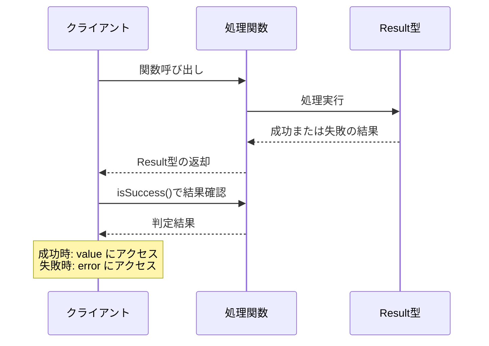
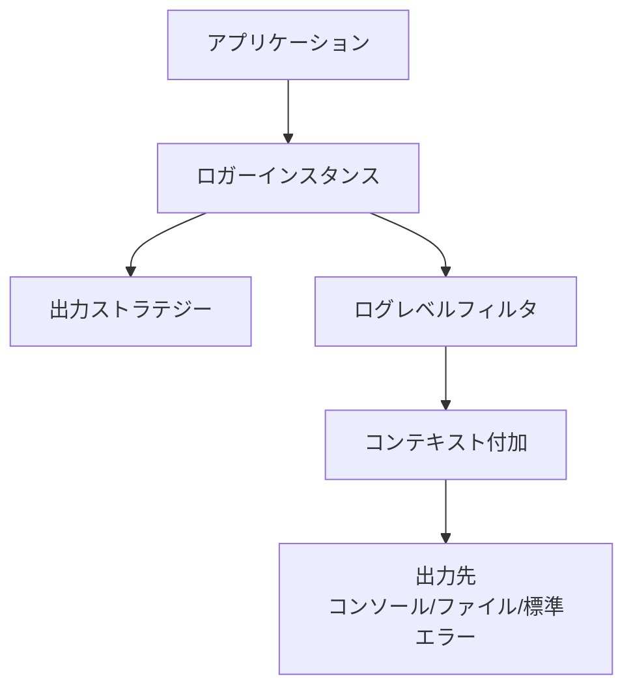
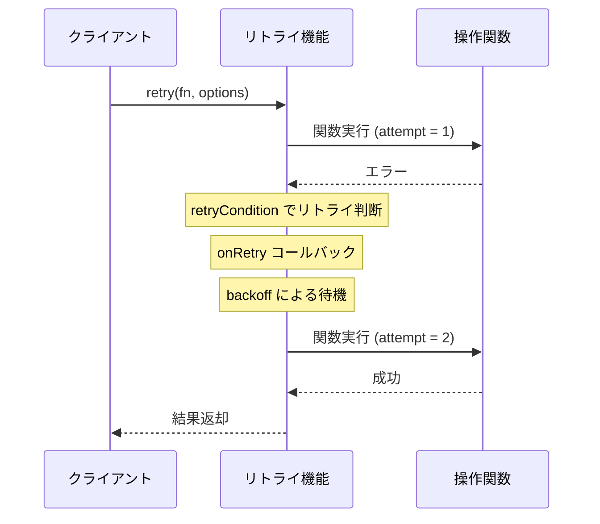
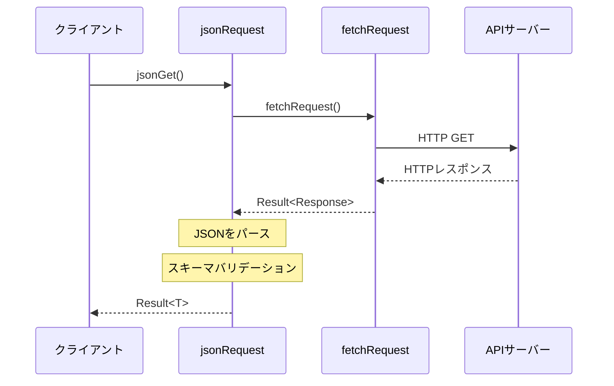

# libca API ドキュメント

libcaは、単一責任の原則に従って設計された汎用ライブラリ集です。インターフェースベースの設計により、将来的な実装の変更や拡張に対応しています。このドキュメントでは、libcaの各モジュールのAPIについて詳細に説明します。

## 目次

- [Result モジュール](#result-モジュール)
- [Logger モジュール](#logger-モジュール)
- [Retry モジュール](#retry-モジュール)
- [Fetch モジュール](#fetch-モジュール)
- [MCP モジュール](#mcp-モジュール)

## Result モジュール

### 概要

Result モジュールは、例外を使わずに成功・失敗を表現するResult型とその操作関数を提供します。関数が失敗する可能性を型情報として表現し、コンパイル時に適切なエラーハンドリングを強制することができます。

### 型定義

#### `Result<T, E>`

成功または失敗を表すユニオン型です。

```typescript
type Result<T, E> = Success<T> | Failure<E>;
```

#### `Success<T>`

成功を表す型です。

```typescript
interface Success<T> {
  success: true;
  value: T;
}
```

#### `Failure<E>`

失敗を表す型です。

```typescript
interface Failure<E> {
  success: false;
  error: E;
}
```

#### `ErrorInfoBase`

エラー情報の基本インターフェースです。

```typescript
interface ErrorInfoBase {
  message: string;
  recoverable: boolean;
  cause?: Error | undefined;
  stack?: string | undefined;
}
```

#### `ErrorInfo<TType, TCode, TExtra>`

拡張可能なエラー情報型です。

```typescript
type ErrorInfo<
  TType extends string,
  TCode extends string,
  TExtra = Record<string, unknown>
> = ErrorInfoBase & {
  type: TType;
  code: TCode;
} & TExtra;
```

#### 特殊化されたエラー型

- `ValidationErrorInfo` - バリデーションエラー (`type: "validation"`)
- `SystemErrorInfo` - システムエラー (`type: "system"`)
- `NetworkErrorInfo` - ネットワークエラー (`type: "network"`)
- `HttpErrorInfo` - HTTPエラー (`type: "http"`)
- `DatabaseErrorInfo` - データベースエラー (`type: "database"`)
- `IOErrorInfo` - I/Oエラー (`type: "io"`)

### 関数

#### 型ガード関数

##### `isSuccess<T, E>(result: Result<T, E>): result is Success<T>`

Resultが成功かどうかをチェックする型ガードです。

```typescript
const result = success("データ");
if (isSuccess(result)) {
  // result.value にアクセスできる
  console.log(result.value);
}
```

##### `isFailure<T, E>(result: Result<T, E>): result is Failure<E>`

Resultが失敗かどうかをチェックする型ガードです。

```typescript
const result = failure(createSystemError("エラーが発生しました"));
if (isFailure(result)) {
  // result.error にアクセスできる
  console.log(result.error.message);
}
```

#### 生成関数

##### `success<T>(value: T): Success<T>`

成功のResultを作成します。

```typescript
const successResult = success(42);
```

##### `failure<E>(error: E): Failure<E>`

失敗のResultを作成します。

```typescript
const errorInfo = createSystemError("システムエラーが発生しました");
const failureResult = failure(errorInfo);
```

#### 値取得関数

##### `unwrap<T, E>(result: Result<T, E>, fallback: T): T`

Resultから値を取り出します。失敗の場合はフォールバック値を返します。

```typescript
const result = success(42);
const value = unwrap(result, 0); // 42

const failResult = failure(createSystemError("エラー"));
const fallbackValue = unwrap(failResult, 0); // 0
```

##### `unwrapOrThrow<T, E>(result: Result<T, E>, errorTransformer?: (error: E) => Error): T`

Resultから値を取り出します。失敗の場合は例外をスローします。

```typescript
try {
  const result = success(42);
  const value = unwrapOrThrow(result); // 42
  
  const failResult = failure(createSystemError("エラー"));
  const value2 = unwrapOrThrow(failResult); // 例外がスローされる
} catch (error) {
  console.error("エラーが発生しました:", error);
}
```

#### 変換関数

##### `map<T, U, E>(result: Result<T, E>, fn: (value: T) => U): Result<U, E>`

Result内の値を変換します。

```typescript
const result = success(42);
const mappedResult = map(result, value => value * 2);
// success(84)
```

##### `flatMap<T, U, E>(result: Result<T, E>, fn: (value: T) => Result<U, E>): Result<U, E>`

Result内の値を別のResultに変換します。

```typescript
const result = success(42);
const flatMappedResult = flatMap(result, value => {
  return value > 0 ? success(value * 2) : failure(createValidationError("値は正でなければなりません"));
});
// success(84)
```

##### `mapError<T, E, F>(result: Result<T, E>, fn: (error: E) => F): Result<T, F>`

Result内のエラーを変換します。

```typescript
const result = failure(createSystemError("システムエラー"));
const mappedError = mapError(result, error => createValidationError("変換されたエラー"));
// failure(ValidationErrorInfo)
```

#### 非同期関数

##### `mapAsync<T, U, E>(result: Result<T, E>, fn: (value: T) => Promise<U>): Promise<Result<U, E>>`

Result内の値を非同期に変換します。

```typescript
const result = success(42);
const asyncResult = await mapAsync(result, async value => {
  const response = await fetch(`https://api.example.com/${value}`);
  return response.json();
});
```

##### `flatMapAsync<T, U, E>(result: Result<T, E>, fn: (value: T) => Promise<Result<U, E>>): Promise<Result<U, E>>`

Result内の値を非同期に別のResultに変換します。

```typescript
const result = success(42);
const asyncResult = await flatMapAsync(result, async value => {
  try {
    const response = await fetch(`https://api.example.com/${value}`);
    if (!response.ok) {
      return failure(createHttpError("APIエラー", response.status));
    }
    return success(await response.json());
  } catch (error) {
    return failure(createNetworkError("ネットワークエラー"));
  }
});
```

##### `tryAsync<T, Args extends unknown[]>(fn: (...args: Args) => Promise<T>, ...args: Args): Promise<Result<T, Error>>`

非同期関数の実行結果をResultでラップします。

```typescript
const fetchData = async (id: string) => {
  const response = await fetch(`https://api.example.com/${id}`);
  if (!response.ok) throw new Error("APIエラー");
  return response.json();
};

const result = await tryAsync(fetchData, "user-123");
```

##### `all<T, E>(results: Result<T, E>[]): Result<T[], E>`

複数のResultを結合します。すべて成功した場合は値の配列を含むResult、一つでも失敗した場合は最初の失敗を返します。

```typescript
const results = [success(1), success(2), success(3)];
const combinedResult = all(results);
// success([1, 2, 3])

const mixedResults = [success(1), failure(createSystemError("エラー")), success(3)];
const failedCombination = all(mixedResults);
// failure(SystemErrorInfo)
```

#### エラー作成関数

##### `createErrorInfo<TType, TCode, TExtra>(params): ErrorInfo<TType, TCode, TExtra>`

カスタムエラー情報を作成する汎用関数です。

```typescript
const customError = createErrorInfo({
  type: "custom",
  code: "not_implemented",
  message: "この機能は実装されていません",
  recoverable: true,
  additionalInfo: "追加情報"
});
```

##### 特殊化されたエラー作成関数

- `createValidationError(message: string, field?: string): ValidationErrorInfo`
- `createSystemError(message: string, code?: string): SystemErrorInfo`
- `createNetworkError(message: string, url?: string): NetworkErrorInfo`
- `createHttpError(message: string, statusCode: number, url?: string): HttpErrorInfo`
- `createDatabaseError(message: string, operation?: string, table?: string): DatabaseErrorInfo`
- `createIOError(message: string, path?: string, operation?: string): IOErrorInfo`

```typescript
// バリデーションエラーの例
const validationError = createValidationError("メールアドレスの形式が不正です", "email");

// HTTPエラーの例
const httpError = createHttpError("リソースが見つかりません", 404, "https://api.example.com/users/123");
```

### 使用例

```typescript
import { success, failure, isSuccess, unwrap, createSystemError } from "libca";

// 成功の例
const successResult = success("Hello via Bun!");
console.log("Success result:", successResult);
console.log("Is success?", isSuccess(successResult));
console.log("Value:", unwrap(successResult, "Default value"));

// 失敗の例
const errorInfo = createSystemError("Something went wrong");
const failureResult = failure(errorInfo);
console.log("Failure result:", failureResult);
console.log("Is success?", isSuccess(failureResult));
console.log("Value with fallback:", unwrap(failureResult, "Default value"));
```

### シーケンス図: Result型を使ったエラーハンドリングフロー



## Logger モジュール

### 概要

Logger モジュールは、拡張性のあるログ出力機能を提供します。様々な出力戦略（コンソール、標準エラー、JSONL形式）をサポートし、実行環境（ブラウザ/Node.js/Bun）に応じた最適なデフォルト戦略を自動選択します。MCPサーバーとの互換性を考慮し、stdout汚染を避ける設計になっています。

### 型定義

#### `LogLevel`

ログレベルを表す型です。

```typescript
type LogLevel = 'debug' | 'info' | 'warn' | 'error';
```

#### `LogStrategy`

ログ出力戦略のインターフェースです。

```typescript
interface LogStrategy {
  log(level: LogLevel, ...args: unknown[]): void;
}
```

#### `Logger`

ロガーのインターフェースです。

```typescript
interface Logger {
  debug(...args: unknown[]): void;
  info(...args: unknown[]): void;
  warn(...args: unknown[]): void;
  error(...args: unknown[]): void;
  withContext(context: string): Logger;
}
```

#### `LoggerOptions`

ロガー作成のオプションです。

```typescript
interface LoggerOptions {
  strategy?: LogStrategy;
  minLevel?: LogLevel;
  defaultContext?: string;
}
```

#### `JsonlStrategyOptions`

JSONL形式出力戦略のオプションです。

```typescript
interface JsonlStrategyOptions {
  destination: 'stdout' | 'stderr' | string;
  formatOptions?: {
    includeTimestamp?: boolean;
    maxDepth?: number;
    maxArrayLength?: number;
  };
}
```

### 関数

#### ロガー作成

##### `createLogger(options?: LoggerOptions): Logger`

ロガーを作成します。オプションが指定されていない場合は、環境に応じたデフォルト戦略が使用されます。

```typescript
// デフォルトロガーを作成
const logger = createLogger();

// カスタムオプションを使ったロガーを作成
const customLogger = createLogger({
  minLevel: "info",
  defaultContext: "App"
});
```

#### ロガー操作

##### `logger.debug(...args: unknown[]): void`

デバッグログを出力します。

```typescript
logger.debug("デバッグ情報:", { data: 123 });
```

##### `logger.info(...args: unknown[]): void`

情報ログを出力します。

```typescript
logger.info("アプリケーションが起動しました");
```

##### `logger.warn(...args: unknown[]): void`

警告ログを出力します。

```typescript
logger.warn("非推奨の機能が使用されました");
```

##### `logger.error(...args: unknown[]): void`

エラーログを出力します。

```typescript
try {
  throw new Error("エラーが発生しました");
} catch (err) {
  logger.error("障害が発生しました:", err);
}
```

##### `logger.withContext(context: string): Logger`

コンテキスト付きの新しいロガーを作成します。

```typescript
const dbLogger = logger.withContext("Database");
dbLogger.info("接続が確立されました");
// 出力: [Database] 接続が確立されました
```

#### 出力戦略作成

##### `createConsoleStrategy(): LogStrategy`

コンソール出力戦略を作成します。色付きの出力に対応しています。

```typescript
const consoleLogger = createLogger({
  strategy: createConsoleStrategy()
});
```

##### `createStderrStrategy(): LogStrategy`

標準エラー出力戦略を作成します。標準出力を汚さないようにすべてのログを標準エラー出力に書き込みます。

```typescript
const stderrLogger = createLogger({
  strategy: createStderrStrategy()
});
```

##### `createJsonlStrategy(options: JsonlStrategyOptions): LogStrategy`

JSONL形式出力戦略を作成します。構造化されたログ出力が可能です。

```typescript
const jsonlLogger = createLogger({
  strategy: createJsonlStrategy({
    destination: "app.log",
    formatOptions: {
      includeTimestamp: true,
      maxDepth: 3
    }
  })
});
```

### デフォルトロガー

```typescript
import { logger } from "libca";

// デフォルトロガーを使用
logger.info("アプリケーションが起動しました");
```

### 使用例

```typescript
import { createLogger, createJsonlStrategy } from "libca";

// デフォルトロガーを作成
const logger = createLogger();
logger.info("アプリケーションが起動しました");

// コンテキスト付きロガーを作成
const dbLogger = logger.withContext("Database");
dbLogger.info("接続が確立されました");

// カスタムストラテジーを使用
const fileLogger = createLogger({
  strategy: createJsonlStrategy({ destination: "app.log" }),
  minLevel: "info"
});
fileLogger.error("重大なエラーが発生しました", new Error("データベース接続失敗"));
```

### フロー図: ロガーモジュールの動作



## Retry モジュール

### 概要

Retry モジュールは、失敗した操作を設定可能なバックオフ戦略で再試行するための機能を提供します。バックオフとは、リトライの間隔を徐々に広げていく戦略で、指数バックオフやジッター機能をサポートします。

### 特徴

- 関数型プログラミングスタイルによる宣言的な実装
- 通常の関数とResult型を返す関数の両方のリトライをサポート
- カスタマイズ可能なバックオフ戦略
- リトライ条件やコールバックによる詳細な制御

### 型定義

#### `BackoffOptions`

バックオフ関連のオプションです。

```typescript
type BackoffOptions = {
  readonly baseMs?: number;
  readonly maxMs?: number;
  readonly jitterFactor?: number;
};
```

#### `BackoffFunction`

バックオフ関数の型です。

```typescript
type BackoffFunction = (attempt: number) => Promise<void>;
```

#### `RetryCondition`

リトライ条件を判定する関数の型です。

```typescript
type RetryCondition<E = unknown> = (error: E, attempt: number) => boolean;
```

#### `RetryOptions`

通常のリトライ用オプションです。

```typescript
type RetryOptions<E = unknown> = {
  readonly maxRetries: number;
  readonly backoff?: BackoffFunction;
  readonly retryCondition?: RetryCondition<E>;
  readonly onRetry?: (attempt: number, error: E) => void;
};
```

#### `RetryResultOptions`

Result型を使用するリトライ用のオプションです。

```typescript
type RetryResultOptions<E> = RetryOptions<E>;
```

### 関数

#### バックオフ関数

##### `createBackoff(options?: BackoffOptions): BackoffFunction`

カスタムバックオフ関数を作成します。

```typescript
const backoff = createBackoff({
  baseMs: 100,
  maxMs: 5000,
  jitterFactor: 0.3
});
```

##### `exponentialBackoffWithJitter(options?: BackoffOptions): BackoffFunction`

ジッターを含む指数バックオフ関数を作成します。ジッターとは、再試行間隔にランダムな変動を加えることで、複数のクライアントが同時に再試行するのを防ぐ技術です。

```typescript
const backoff = exponentialBackoffWithJitter({
  baseMs: 100,
  maxMs: 10000,
  jitterFactor: 0.5
});
```

##### `exponentialBackoff(baseMs = 200): BackoffFunction`

シンプルな指数バックオフ関数を作成します（ジッターなし）。

```typescript
const backoff = exponentialBackoff(150);
```

#### 基本リトライ関数

##### `retry<T, E = Error>(fn: () => T, options: RetryOptions<E>): Promise<T>`

同期関数をリトライします。エラーが発生した場合、指定された回数まで再試行します。

```typescript
const result = await retry(
  () => riskyOperation(),
  {
    maxRetries: 3,
    backoff: exponentialBackoffWithJitter({ baseMs: 250 }),
    onRetry: (attempt, error) => console.log(`再試行 #${attempt}:`, error)
  }
);
```

##### `retryAsync<T, E = Error>(fn: () => Promise<T>, options: RetryOptions<E>): Promise<T>`

非同期関数をリトライします。

```typescript
const data = await retryAsync(
  async () => {
    const response = await fetch("https://api.example.com/data");
    if (!response.ok) throw new Error(`HTTP Error: ${response.status}`);
    return response.json();
  },
  {
    maxRetries: 5,
    retryCondition: (error, attempt) => {
      // 一時的なエラーのみリトライ
      return error instanceof Error && 
        error.message.includes("timeout") &&
        attempt < 3;
    }
  }
);
```

#### Result型リトライ関数

##### `retryResult<T, E extends ErrorInfo<string, string>>(fn: () => Promise<Result<T, E>>, options: RetryResultOptions<E>): Promise<Result<T, E>>`

Result型を返す非同期関数をリトライします。失敗（isFailure）かつエラーが回復可能（error.recoverable === true）な場合のみリトライします。

```typescript
import { success, failure, createNetworkError, retryResult } from "libca";

const result = await retryResult(
  async () => {
    try {
      const response = await fetch("https://api.example.com/data");
      if (!response.ok) {
        return failure(createHttpError("APIエラー", response.status));
      }
      return success(await response.json());
    } catch (error) {
      return failure(createNetworkError("ネットワークエラー", "https://api.example.com/data"));
    }
  },
  {
    maxRetries: 3,
    // 回復可能なエラーのみをリトライ（デフォルト動作）
    retryCondition: (error) => error.recoverable === true
  }
);
```

### 使用例

```typescript
import {
  retry,
  retryAsync,
  retryResult,
  exponentialBackoffWithJitter,
  createSystemError,
  failure,
  success
} from "libca";

// 基本的なリトライ
try {
  const result = await retry(
    () => riskyOperation(),
    {
      maxRetries: 3,
      onRetry: (attempt, error) => {
        console.log(`試行 ${attempt} が失敗しました: ${error.message}`);
      }
    }
  );
  console.log("成功:", result);
} catch (error) {
  console.error("すべての試行が失敗しました:", error);
}

// 非同期関数とカスタムバックオフ
const data = await retryAsync(
  async () => {
    const response = await fetch("https://api.example.com/data");
    if (!response.ok) throw new Error(`HTTP Error: ${response.status}`);
    return response.json();
  },
  {
    maxRetries: 5,
    backoff: exponentialBackoffWithJitter({
      baseMs: 200,
      maxMs: 5000,
      jitterFactor: 0.3
    }),
    retryCondition: (error, attempt) => {
      // 一時的なエラーのみリトライ
      return error instanceof Error && 
        (error.message.includes("timeout") || error.message.includes("5")) &&
        attempt < 3;
    }
  }
);

// Result型を使ったリトライ
const apiCall = async (id: string) => {
  try {
    const response = await fetch(`https://api.example.com/users/${id}`);
    
    if (!response.ok) {
      const isServerError = response.status >= 500;
      return failure(createHttpError(
        "APIリクエストが失敗しました", 
        response.status,
        `https://api.example.com/users/${id}`
      ));
    }
    
    return success(await response.json());
  } catch (error) {
    return failure(createNetworkError(
      "ネットワークエラーが発生しました",
      `https://api.example.com/users/${id}`
    ));
  }
};

const userResult = await retryResult(
  () => apiCall("123"),
  { maxRetries: 3 }
);
```

### シーケンス図: リトライロジックのフロー



## Fetch モジュール

### 概要

Fetch モジュールは、汎用的かつ堅牢なHTTP機能を提供します。基本的なFetch機能、JSON機能、ストリーミング機能を純粋関数として提供し、それぞれ異なるユースケースに対応します。タイムアウト、リトライ、エラーハンドリング、レスポンスのバリデーション、ストリーミング処理などの機能を備えています。

### 特徴

- タイムアウト機能
- リトライ機能
- エラーハンドリング
- レスポンスのバリデーション
- ストリーミング処理
- Result型との統合

### 型定義

#### `HttpMethod`

HTTPメソッドを表す型です。

```typescript
type HttpMethod = "GET" | "POST" | "PUT" | "DELETE" | "PATCH" | "HEAD" | "OPTIONS";
```

#### `FetchConfig`

Fetch設定オブジェクトです。

```typescript
interface FetchConfig {
  baseUrl?: string;
  headers?: Record<string, string>;
  timeout?: number;
  retry?: RetryOptions;
  logger?: Logger;
}
```

#### `JsonConfig`

JSON設定オブジェクトです。

```typescript
interface JsonConfig extends FetchConfig {
  // JSON特有の設定オプションがあれば追加
}
```

#### `StreamConfig`

ストリーミング設定オブジェクトです。

```typescript
interface StreamConfig extends FetchConfig {
  // ストリーミング特有の設定オプションがあれば追加
}
```

#### `RequestOptions`

リクエストオプションです。

```typescript
interface RequestOptions {
  method?: HttpMethod;
  params?: Record<string, string | number | boolean | undefined>;
  headers?: Record<string, string>;
  body?: unknown;
  timeout?: number;
  retry?: RetryOptions;
}
```

#### `FetchErrorInfo`

Fetchエラー情報型です。

```typescript
type FetchErrorInfo = ErrorInfo<
  "fetch",
  FetchErrorCode,
  {
    statusCode?: number;
    url: string;
    method: HttpMethod;
    response?: unknown;
    recoverable: boolean;
    cause?: Error;
  }
>;
```

#### `StreamingOptions`

ストリーミングオプションです。

```typescript
interface StreamingOptions extends RequestOptions {
  onChunk?: (chunk: string) => void;
  onComplete?: () => void;
  onError?: (error: FetchErrorInfo) => void;
  logger?: Logger;
}
```

### 関数

#### 基本的なFetch関数

##### `createFetchConfig(config?: Partial<FetchConfig>): FetchConfig`

Fetch設定オブジェクトを作成します。

```typescript
const config = createFetchConfig({
  baseUrl: "https://api.example.com",
  timeout: 5000,
  headers: {
    "Authorization": "Bearer token123"
  }
});
```

##### `fetchRequest<T = Response>(config: FetchConfig, path: string, options?: RequestOptions): Promise<Result<T, FetchErrorInfo>>`

HTTP リクエストを送信し、Result型でレスポンスを返します。

```typescript
const result = await fetchRequest(config, "/users", {
  method: "POST",
  body: JSON.stringify({ name: "John Doe" }),
  headers: {
    "Content-Type": "application/json"
  }
});
```

##### ショートハンド関数

- `fetchGet(config, path, options?)`
- `fetchPost(config, path, body?, options?)`
- `fetchPut(config, path, body?, options?)`
- `fetchDelete(config, path, options?)`
- `fetchPatch(config, path, body?, options?)`
- `fetchHead(config, path, options?)`
- `fetchOptions(config, path, options?)`

```typescript
// GETリクエスト
const userResult = await fetchGet(config, "/users/123");

// POSTリクエスト
const createResult = await fetchPost(
  config,
  "/users",
  { name: "Jane Doe", email: "jane@example.com" }
);
```

#### JSON関数

##### `createJsonConfig(config?: Partial<JsonConfig>): JsonConfig`

JSON設定オブジェクトを作成します。

```typescript
const jsonConfig = createJsonConfig({
  baseUrl: "https://api.example.com",
  headers: {
    "Accept": "application/json"
  }
});
```

##### `jsonRequest<T = unknown>(config: JsonConfig, validator?: z.ZodType<T>, path: string, options?: RequestOptions): Promise<Result<T, FetchErrorInfo>>`

JSONリクエストを送信し、オプションでZodバリデーションを適用してResult型で返します。

```typescript
import { z } from "zod";

const userSchema = z.object({
  id: z.number(),
  name: z.string(),
  email: z.string().email(),
});

type User = z.infer<typeof userSchema>;

const userResult = await jsonRequest<User>(
  jsonConfig,
  userSchema,
  "/users/123"
);
```

##### JSONショートハンド関数

- `jsonGet<T>(config, schema?, path, options?)`
- `jsonPost<T>(config, schema?, path, body?, options?)`
- `jsonPut<T>(config, schema?, path, body?, options?)`
- `jsonDelete<T>(config, schema?, path, options?)`
- `jsonPatch<T>(config, schema?, path, body?, options?)`

```typescript
// GETリクエスト
const usersResult = await jsonGet(
  jsonConfig,
  z.array(userSchema),
  "/users"
);

// POSTリクエストとバリデーション
const newUserResult = await jsonPost(
  jsonConfig,
  userSchema,
  "/users",
  { name: "Alice", email: "alice@example.com" }
);
```

#### ストリーミング関数

##### `createStreamConfig(config?: Partial<StreamConfig>): StreamConfig`

ストリーミング設定オブジェクトを作成します。

```typescript
const streamConfig = createStreamConfig({
  baseUrl: "https://api.example.com",
  timeout: 0  // ストリーミングの場合はタイムアウトを無効に
});
```

##### `streamRequest(config: StreamConfig, path: string, options: StreamingOptions): Promise<Result<void, FetchErrorInfo>>`

ストリーミングリクエストを送信し、チャンクごとに処理します。

```typescript
const result = await streamRequest(streamConfig, "/events", {
  onChunk: (chunk) => {
    console.log("受信データ:", chunk);
  },
  onComplete: () => {
    console.log("ストリーム完了");
  },
  onError: (error) => {
    console.error("ストリームエラー:", error.message);
  }
});
```

##### `parseSSE(chunk: string): Record<string, string> | null`

Server-Sent Events (SSE) チャンクをパースします。

```typescript
await streamRequest(streamConfig, "/events", {
  onChunk: (chunk) => {
    const event = parseSSE(chunk);
    if (event) {
      console.log("イベント:", event.event, "データ:", event.data);
    }
  }
});
```

### 使用例

```typescript
import {
  createFetchConfig,
  fetchGet,
  createJsonConfig,
  jsonPost,
  createStreamConfig,
  streamRequest,
  parseSSE,
  isSuccess
} from "libca";
import { z } from "zod";

// 基本的なFetch関数
const config = createFetchConfig({
  baseUrl: "https://api.example.com",
  timeout: 5000,
});

const result = await fetchGet(config, "/users/1");
if (isSuccess(result)) {
  const response = result.value;
  const data = await response.json();
  console.log(data);
}

// JSON関数
const jsonConfig = createJsonConfig({
  baseUrl: "https://api.example.com",
});

const userSchema = z.object({
  id: z.number(),
  name: z.string(),
  email: z.string().email(),
});

const userResult = await jsonGet(jsonConfig, userSchema, "/users/1");
if (isSuccess(userResult)) {
  // 型安全なデータアクセス
  console.log(userResult.value.name);
}

// ストリーミング関数
const streamConfig = createStreamConfig({
  baseUrl: "https://api.example.com",
});

await streamRequest(streamConfig, "/events", {
  onChunk: (chunk) => {
    const event = parseSSE(chunk);
    console.log("イベント:", event);
  },
  onComplete: () => console.log("ストリーム完了"),
});
```

### シーケンス図: JSON APIリクエストのフロー



## MCP モジュール

### 概要

MCP（Model Context Protocol）モジュールは、Model Context Protocol のサーバー作成・設定・実行機能を提供します。このモジュールは、ツール、リソース、プロンプトの定義と管理、クライアント接続管理とツール実行、エラーハンドリングとロギング連携、拡張性を考慮した設計を提供します。

### 特徴

- MCPサーバーの作成と設定
- ツール、リソース、プロンプトの定義
- クライアント接続管理
- エラーハンドリング
- ロギング連携

### 主要な型定義

#### サーバー関連の型

```typescript
interface McpServer {
  // サーバーのインターフェース
}

interface McpServerConfig {
  // サーバー設定
}

interface ToolDefinition {
  // ツール定義
}

interface ResourceDefinition {
  // リソース定義
}

interface PromptDefinition {
  // プロンプト定義
}

interface ToolRequest {
  // ツールリクエスト
}

interface ToolResponse {
  // ツールレスポンス
}

// その他のコンテンツ型
interface TextContent {}
interface ImageContent {}
interface ResourceResponse {}
```

#### ハンドラー関連の型

```typescript
interface ToolHandler {
  // ツールハンドラー
}

interface ToolHandlerResult {
  // ツールハンドラーの結果
}

interface ResourceHandler {
  // リソースハンドラー
}

interface ResourceHandlerResult {
  // リソースハンドラーの結果
}
```

#### クライアント関連の型

```typescript
interface McpClient {
  // クライアントインターフェース
}

interface McpClientConfig {
  // クライアント設定
}

interface ConnectionInfo {
  // 接続情報
}

type ConnectionStatus = string;
type ConnectionType = string;

interface ProcessManager {
  // プロセス管理
}

interface ConnectionManager {
  // 接続管理
}
```

#### エラー関連の型

```typescript
interface McpErrorInfo {
  // MCPエラー情報
}

type McpErrorKind = string;
```

### 主要な関数

#### サーバー関連

##### `createMcpServer(config: McpServerConfig): McpServer`

MCPサーバーを作成します。

```typescript
const server = createMcpServer({
  name: "example-server",
  tools: [
    {
      name: "echo",
      description: "メッセージをそのまま返すエコーツール",
      inputSchema: {
        type: "object",
        properties: {
          message: { type: "string" }
        },
        required: ["message"]
      },
      handler: async (request) => {
        const { message } = request.arguments;
        return createSimpleTextResponse(message);
      }
    }
  ],
  resources: [
    {
      uri: "example://data",
      handler: async () => {
        return { content: "リソースデータ" };
      }
    }
  ]
});
```

#### クライアント関連

##### `createMcpClient(config: McpClientConfig): McpClient`

MCPクライアントを作成します。

```typescript
const client = createMcpClient({
  serverUrl: "http://localhost:3000",
  connectionTimeout: 5000
});
```

##### `createProcessManager(): ProcessManager`

プロセスマネージャーを作成します。

```typescript
const processManager = createProcessManager();
```

#### ユーティリティ関数

##### コンテンツ変換ユーティリティ

- `createTextContent(text: string): TextContent`
- `createImageContent(url: string, alt?: string): ImageContent`
- `createToolResponse(content: ToolResponseContent): ToolResponse`
- `createSimpleTextResponse(text: string): ToolResponse`
- `createJsonResponse(data: any): ToolResponse`
- `createErrorResponse(error: Error | string): ToolResponse`

```typescript
// テキストコンテンツの作成
const textContent = createTextContent("Hello, world!");

// ツールレスポンスの作成
const response = createSimpleTextResponse("操作が完了しました");

// JSONレスポンスの作成
const jsonResponse = createJsonResponse({ 
  success: true, 
  data: { id: 123, name: "Example" } 
});

// エラーレスポンスの作成
const errorResponse = createErrorResponse("リソースが見つかりません");
```

##### 標準出力保護機能

- `enableStdoutGuard(): void`
- `disableStdoutGuard(): void`
- `isStdoutGuardEnabled(): boolean`

```typescript
// MCPサーバー開始前に標準出力保護を有効化
enableStdoutGuard();

// 保護状態の確認
const isGuarded = isStdoutGuardEnabled();
console.log(`標準出力保護: ${isGuarded ? '有効' : '無効'}`);

// 不要になったら無効化
disableStdoutGuard();
```

#### エラー関連関数

- `createConnectionError(message: string, ...): McpErrorInfo`
- `createCommunicationError(message: string, ...): McpErrorInfo`
- `createTimeoutError(message: string, ...): McpErrorInfo`
- `createParsingError(message: string, ...): McpErrorInfo`
- `createExecutionError(message: string, ...): McpErrorInfo`
- `createMcpError(message: string, ...): McpErrorInfo`

```typescript
// 接続エラーの作成
const connectionError = createConnectionError("サーバーに接続できません");

// タイムアウトエラーの作成
const timeoutError = createTimeoutError("リクエストがタイムアウトしました", {
  url: "https://api.example.com"
});
```

### 使用例

以下は、MCPサーバーを作成して実行する例です：

```typescript
import {
  createMcpServer,
  createTextContent,
  createSimpleTextResponse,
  enableStdoutGuard
} from "libca";

// 標準出力保護を有効化
enableStdoutGuard();

// MCPサーバーの作成
const server = createMcpServer({
  name: "example-tools",
  version: "1.0.0",
  tools: [
    {
      name: "greet",
      description: "挨拶を返すツール",
      inputSchema: {
        type: "object",
        properties: {
          name: { type: "string", description: "挨拶する相手の名前" }
        },
        required: ["name"]
      },
      handler: async (request) => {
        const { name } = request.arguments;
        return createSimpleTextResponse(`こんにちは、${name}さん！`);
      }
    },
    
    {
      name: "calculate",
      description: "簡単な計算を行うツール",
      inputSchema: {
        type: "object",
        properties: {
          operation: { 
            type: "string", 
            enum: ["add", "subtract", "multiply", "divide"],
            description: "実行する演算"
          },
          a: { type: "number", description: "最初のオペランド" },
          b: { type: "number", description: "2番目のオペランド" }
        },
        required: ["operation", "a", "b"]
      },
      handler: async (request) => {
        const { operation, a, b } = request.arguments;
        
        let result;
        switch (operation) {
          case "add": result = a + b; break;
          case "subtract": result = a - b; break;
          case "multiply": result = a * b; break;
          case "divide": 
            if (b === 0) {
              return createErrorResponse("0で除算できません");
            }
            result = a / b; 
            break;
          default:
            return createErrorResponse("不明な演算: " + operation);
        }
        
        return createJsonResponse({
          operation,
          a,
          b,
          result
        });
      }
    }
  ],
  
  resources: [
    {
      uri: "example://help",
      handler: async () => {
        return createTextContent("このサーバーは、挨拶と計算機能を提供します。");
      }
    }
  ]
});

// サーバーの開始
server.start();
console.log("MCPサーバーが起動しました。Ctrl+Cで停止します。");
```

### フロー図: MCPサーバーとクライアントの相互作用

```mermaid
sequenceDiagram
    participant AIアシスタント
    participant MCPクライアント
    participant MCPサーバー
    
    AIアシスタント->>MCPクライアント: ツール使用要求
    MCPクライアント->>MCPサーバー: ツールリクエスト
    
    Note over MCPサーバー: ハンドラー実行
    
    MCPサーバー-->>MCPクライアント: ツールレスポンス
    MCPクライアント-->>AIアシスタント: ツール実行結果
    
    AIアシスタント->>MCPクライアント: リソースアクセス要求
    MCPクライアント->>MCPサーバー: リソースリクエスト
    
    Note over MCPサーバー: リソースハンドラー実行
    
    MCPサーバー-->>MCPクライアント: リソースレスポンス
    MCPクライアント-->>AIアシスタント: リソースコンテンツ