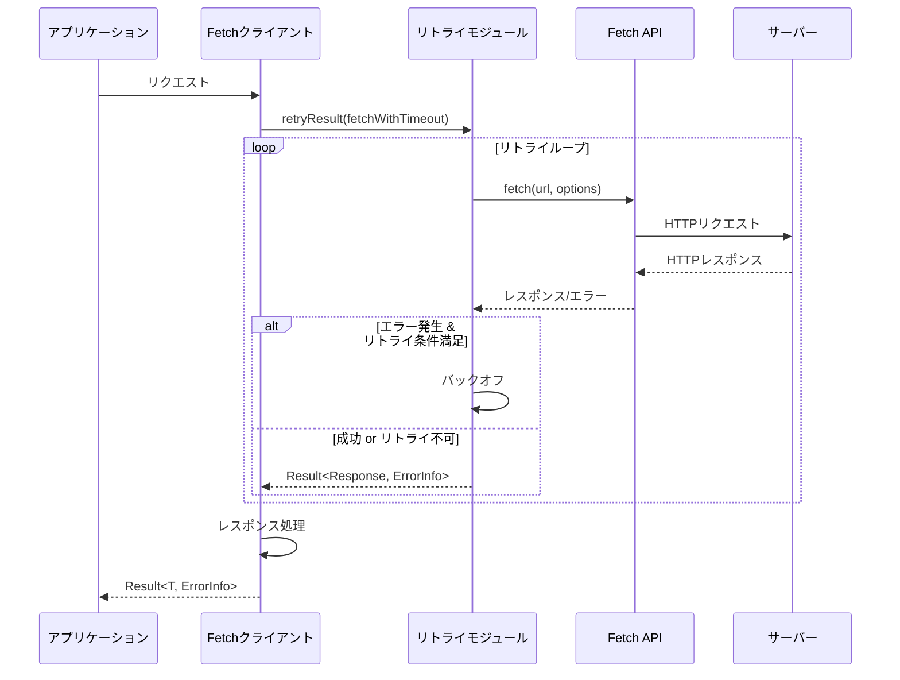
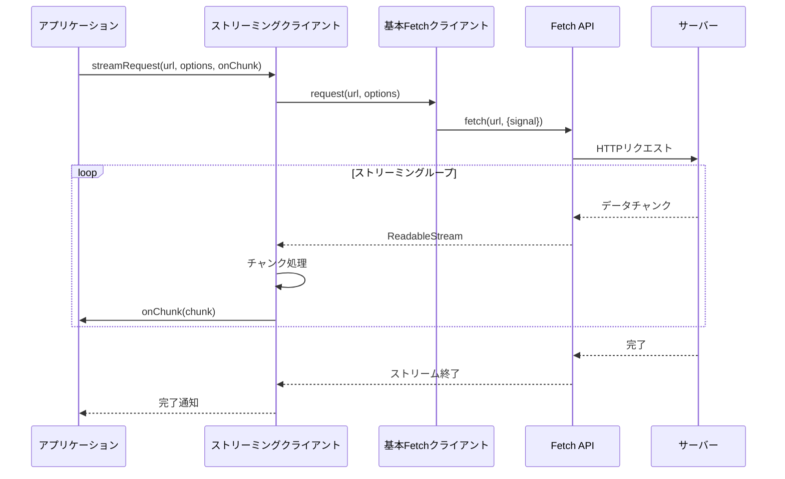
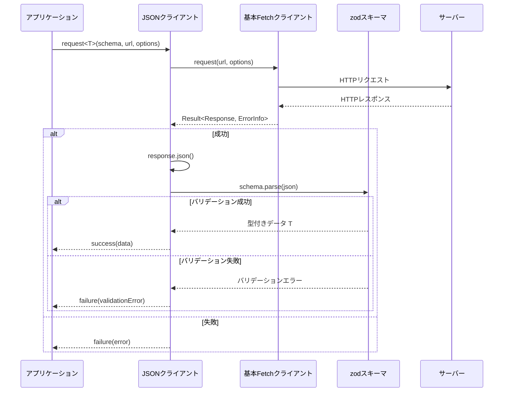
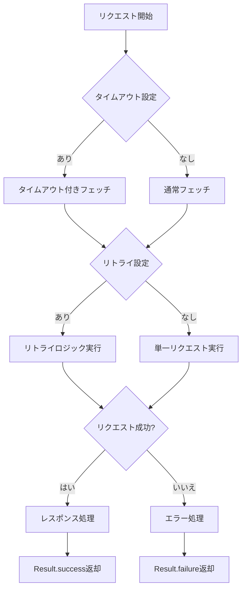

# 設計書：Fetch クライアントモジュール

## ユーザーの意図
既存の複数のプロジェクト（_/agent-core, _/code-sarge, _/ole-copipe）から汎化できるコードをライブラリとして実装する。特に以下の2種類のFetchクライアントを実装する：

1. 汎用的かつ堅牢なFetchクライアント（基本版）
   - 既存の retry, result, logger モジュールを活用
   - タイムアウト機能
   - エラーハンドリング機能

2. JSON対応版Fetchクライアント（拡張版）
   - 基本Fetchクライアントを拡張
   - zodスキーマによるレスポンスのバリデーション
   - zodスキーマを利用した型安全性

## 現状
- 既存の複数プロジェクトでHTTPクライアント実装がある
- agent-coreでは、APIクライアント実装が存在（Claude, OpenAI等のために特化）
- ole-copipeには、Anthropic API向けのクライアント実装がある
- libcaには、再利用可能なモジュール（retry, result, logger）がある

## ゴール
- 汎用的かつ堅牢なFetchクライアントモジュールを実装
- JSON対応版Fetchクライアントモジュールを実装
- ストリーミング処理のサポート
- プロジェクト内で共通利用できるライブラリとしての整備
- 型安全なAPI
- 適切なエラーハンドリング（result型を活用）
- リトライ機能
- タイムアウト機能
- ユニットテストの充実

## 用語集
- **Fetchクライアント**: HTTPプロトコルを使用してサーバーとの通信を行うクライアントライブラリ
- **Result型**: 例外を使わずに成功・失敗を表現する型システム
- **リトライ**: 失敗した操作を再試行する機能
- **zodスキーマ**: zodによるバリデーションと型推論のためのスキーマ定義
- **タイムアウト**: 一定時間で応答がない場合に処理を中断する機能
- **ストリーミング**: サーバーから連続的にデータを受信する処理（Server-Sent Events等）

## 実装方針

### ディレクトリ・ファイル構造
```
src/fetch/
├── index.ts           // モジュールのエントリーポイント
├── types.ts           // 型定義
├── error.ts           // エラー定義
├── client.ts          // 基本的なFetchクライアント実装
├── streaming.ts       // ストリーミング処理の実装
├── json-client.ts     // JSONに特化したクライアント実装
├── client.test.ts     // 基本クライアントのテスト
├── streaming.test.ts  // ストリーミング処理のテスト
└── json-client.test.ts // JSONクライアントのテスト
```

### モジュール概要

#### 1. `index.ts`
モジュールのエントリーポイント。公開するAPIを定義。

#### 2. `types.ts`
Fetchクライアントの型定義。リクエスト・レスポンスの型、オプション設定の型など。

#### 3. `error.ts`
Fetchクライアント特有のエラー型と、エラー生成関数。

#### 4. `client.ts`
基本的なFetchクライアント実装。以下の機能を持つ：
- HTTPリクエスト送信機能（GET, POST, PUT, DELETE, PATCH）
- タイムアウト機能
- リトライ機能（retry モジュールを活用）
- エラーハンドリング（result モジュールを活用）
- ロギング（logger モジュールを活用）

#### 5. `streaming.ts`
ストリーミング処理の実装。以下の機能を持つ：
- Server-Sent Events（SSE）のサポート
- ストリームデータの処理
- エラーハンドリング
- コールバック処理

#### 6. `json-client.ts`
JSONに特化したFetchクライアント実装。基本クライアントを拡張し、以下の機能を追加：
- JSONリクエスト・レスポンスの処理
- zodスキーマによるレスポンスバリデーション
- 型安全なAPI

### 参照すべき既存コードと実装方針

以下に、具体的に参照すべき既存プロジェクトのコードとその活用方法を示します。

#### 基本的なFetchクライアント（client.ts）

1. **リトライ機能**
   - 参照: `_/ole-copipe/packages/intent-engine/src/anthropic/client.ts`
   - 活用方法: 
     - 指数バックオフとリトライカウント機能
     - ole-copipeのリトライロジックを、libcaのretryモジュールを使って汎用化
     - 特に94-163行目のリトライループ構造を参考に実装

2. **タイムアウト処理**
   - 参照: `_/agent-core/packages/core/src/core/api-requester.ts`
   - 活用方法:
     - Promise.raceによるタイムアウト処理（92-129行目）
     - AbortControllerを使ったリクエストキャンセル機能

3. **エラーハンドリング**
   - 参照: `_/agent-core/packages/core/src/adapters/api/api-adapter-utils.ts`（271-347行目）
   - 活用方法:
     - エラー情報の分類と構造化
     - 詳細なエラーログ出力
   - 参照: `_/ole-copipe/packages/intent-engine/src/anthropic/error.ts`
   - 活用方法:
     - エラータイプの分類とエラー生成関数

4. **リクエスト処理**
   - 参照: `_/agent-core/packages/core/src/adapters/api/claude-adapter.ts`（174-238行目）
   - 活用方法:
     - fetchによるリクエスト送信と基本的なレスポンス処理
     - ヘッダー操作とリクエストパラメータの標準化

#### ストリーミング処理（streaming.ts）

1. **ストリーム処理基盤**
   - 参照: `_/agent-core/packages/core/src/utils/stream-utils.ts`
   - 活用方法:
     - ストリームリクエスト送信処理（19-75行目）
     - エラーハンドリング

2. **SSE解析**
   - 参照: `_/agent-core/packages/core/src/adapters/api/claude-stream-functions.ts`
   - 活用方法:
     - ストリームレスポンスの解析処理
     - チャンクデータの処理

#### JSON対応クライアント（json-client.ts）

1. **JSONデータ処理**
   - 参照: `_/ole-copipe/packages/intent-engine/src/anthropic/client.ts`
   - 活用方法:
     - JSONレスポンスの処理（129行目）
     - エラー処理との統合

2. **zodスキーマバリデーション**
   - 参照: `_/agent-core/packages/core/src/adapters/api/claude-adapter.ts`（245-259行目）
   - 活用方法:
     - zodスキーマによるレスポンス検証
     - バリデーションエラーハンドリング

3. **型安全な結果変換**
   - 参照: `_/agent-core/packages/core/src/adapters/api/claude-adapter.ts`（684-726行目）
   - 活用方法:
     - 検証されたデータの型変換処理
     - Result型との連携

### シーケンス図
基本的なFetchリクエストのシーケンス図：



ストリーミングリクエストのシーケンス図：



JSON対応クライアントのシーケンス図：



### フロー図
Fetchクライアントのリクエスト処理フロー：



## 実装上の具体的なコード例

### 基本的なFetchクライアント（client.ts）の実装例

```typescript
/**
 * fetchWithTimeout - タイムアウト付きのfetch関数
 * ole-copipeのタイムアウト機能とagent-coreのAbortController機能を参考に実装
 */
export async function _fetchFetchWithTimeout(
  url: string,
  options: RequestInit & { timeout?: number }
): Promise<Result<Response, FetchErrorInfo>> {
  const { timeout, ...fetchOptions } = options;
  
  if (!timeout) {
    try {
      const response = await fetch(url, fetchOptions);
      return _fetchHandleResponse(response, url, fetchOptions.method as HttpMethod);
    } catch (error) {
      return failure(_fetchCreateNetworkError(error, url, fetchOptions.method as HttpMethod));
    }
  }
  
  // AbortControllerを使用したタイムアウト処理
  const controller = new AbortController();
  const timeoutId = setTimeout(() => controller.abort(), timeout);
  
  try {
    const response = await fetch(url, {
      ...fetchOptions,
      signal: controller.signal,
    });
    
    clearTimeout(timeoutId);
    return _fetchHandleResponse(response, url, fetchOptions.method as HttpMethod);
  } catch (error) {
    clearTimeout(timeoutId);
    
    if (error instanceof DOMException && error.name === 'AbortError') {
      return failure(_fetchCreateTimeoutError(timeout, url, fetchOptions.method as HttpMethod));
    }
    
    return failure(_fetchCreateNetworkError(error, url, fetchOptions.method as HttpMethod));
  }
}
```

### ストリーミング処理（streaming.ts）の実装例

```typescript
/**
 * ストリーミングリクエストを送信する
 * agent-coreのsendStreamRequest関数を参考に実装
 */
export async function _fetchStreamRequest(
  url: string, 
  options: StreamingOptions
): Promise<Result<void, FetchErrorInfo>> {
  const { onChunk, onComplete, onError, ...fetchOptions } = options;
  
  try {
    const response = await fetch(url, fetchOptions);
    
    if (!response.ok) {
      const error = await _fetchCreateErrorFromResponse(response, url, fetchOptions.method as HttpMethod);
      if (onError) onError(error);
      return failure(error);
    }
    
    if (!response.body) {
      const error = _fetchCreateErrorInfo(
        'fetch_error',
        'Stream body is null',
        {
          url,
          method: fetchOptions.method as HttpMethod,
          recoverable: false
        }
      );
      if (onError) onError(error);
      return failure(error);
    }
    
    const reader = response.body.getReader();
    const decoder = new TextDecoder();
    
    let done = false;
    while (!done) {
      const { value, done: doneReading } = await reader.read();
      done = doneReading;
      
      if (done) {
        if (onComplete) onComplete();
        break;
      }
      
      const chunk = decoder.decode(value, { stream: true });
      if (onChunk) onChunk(chunk);
    }
    
    return success(undefined);
  } catch (error) {
    const errorInfo = _fetchCreateNetworkError(error, url, fetchOptions.method as HttpMethod);
    if (onError) onError(errorInfo);
    return failure(errorInfo);
  }
}
```

### JSONクライアント（json-client.ts）の実装例

```typescript
/**
 * JSONリクエストを送信し、zodスキーマでバリデーションを行う
 * agent-coreのAPI検証処理を参考に実装
 */
export async function _fetchJsonRequest<T>(
  schema: z.ZodSchema<T>,
  url: string,
  options: RequestOptions
): Promise<Result<T, ErrorInfo<string, string>>> {
  // Content-Typeヘッダーの設定
  const headers = {
    'Content-Type': 'application/json',
    ...options.headers,
  };
  
  // ボディのJSONシリアライズ
  const body = options.body ? JSON.stringify(options.body) : undefined;
  
  // 基本クライアントでリクエスト実行
  const result = await fetchRequest(url, {
    ...options,
    headers,
    body,
  });
  
  if (isFailure(result)) {
    return result;
  }
  
  const response = result.value;
  
  try {
    // レスポンスをJSONとしてパース
    const data = await response.json();
    
    // zodスキーマでバリデーション
    try {
      const validatedData = schema.parse(data);
      return success(validatedData);
    } catch (validationError) {
      if (validationError instanceof z.ZodError) {
        const formattedError = validationError.format();
        return failure(createValidationError(
          `Invalid response format: ${JSON.stringify(formattedError)}`,
          'response'
        ));
      }
      
      return failure(createSystemError(`Unknown validation error: ${String(validationError)}`));
    }
  } catch (error) {
    return failure(createSystemError(`Failed to parse JSON response: ${String(error)}`));
  }
}
```

## ユニットテスト

### 基本Fetchクライアントのテスト
- HTTPメソッド（GET, POST, PUT, DELETE, PATCH）のテスト
- タイムアウトのテスト
- リトライ機能のテスト
- エラーハンドリングのテスト
- ヘッダー・クエリパラメータ機能のテスト

### ストリーミング処理のテスト
- SSEストリーミングリクエストのテスト
- チャンクデータの処理のテスト
- ストリーミングエラーハンドリングのテスト
- 切断・再接続のテスト

### JSON対応Fetchクライアントのテスト
- JSONリクエスト送信のテスト
- JSONレスポンス処理のテスト
- zodスキーマバリデーションのテスト
- バリデーションエラーのテスト

## 動作確認手順
1. `bun run typecheck` -> **Exit 0** を確認
2. `bun run test` -> **fail=0** を確認
3. `use_mcp_tool` code-sarge で、技術的負債を確認

## 型定義
以下に主要な型定義の概要を示します：

### Fetchクライアントオプション
```typescript
export interface FetchClientOptions {
  /** ベースURL */
  baseUrl?: string;
  /** デフォルトのヘッダー */
  headers?: Record<string, string>;
  /** デフォルトのタイムアウト（ミリ秒） */
  timeout?: number;
  /** リトライオプション */
  retry?: RetryOptions;
  /** ロガー */
  logger?: Logger;
}
```

### リクエストオプション
```typescript
export interface RequestOptions {
  /** リクエストメソッド */
  method?: HttpMethod;
  /** URLパラメータ */
  params?: Record<string, string | number | boolean | undefined>;
  /** リクエストヘッダー */
  headers?: Record<string, string>;
  /** リクエストボディ */
  body?: unknown;
  /** タイムアウト（ミリ秒） */
  timeout?: number;
  /** リトライオプション */
  retry?: RetryOptions;
}
```

### ストリーミングオプション
```typescript
export interface StreamingOptions extends RequestOptions {
  /** チャンクデータを受け取るコールバック */
  onChunk?: (chunk: unknown) => void;
  /** ストリーム終了時のコールバック */
  onComplete?: () => void;
  /** エラー発生時のコールバック */
  onError?: (error: ErrorInfo<string, string>) => void;
}
```

### エラー型
```typescript
export type FetchErrorInfo = ErrorInfo<
  "fetch",
  FetchErrorCode,
  {
    statusCode?: number;
    url: string;
    method: HttpMethod;
    response?: unknown;
  }
>;
```

### JSONクライアント用のリクエスト関数
```typescript
export interface JsonClient {
  request<T>(
    schema: z.ZodSchema<T>,
    url: string,
    options?: RequestOptions
  ): Promise<Result<T, ErrorInfo<string, string>>>;
  
  get<T>(
    schema: z.ZodSchema<T>,
    url: string,
    options?: Omit<RequestOptions, "method">
  ): Promise<Result<T, ErrorInfo<string, string>>>;
  
  // post, put, delete, patchメソッドも同様
}
```

### 拡張性
このモジュールは、他のプロジェクトで拡張して使用できるように設計します：

- 基本クラスを継承して独自のクライアントを実装可能
- 型を拡張して特定のAPI向けの型定義を追加可能
- インターフェースを実装して異なる実装を提供可能

これにより、libcaの汎用モジュールとしての役割を保ちながら、各プロジェクトで特定のAPIサービス向けのアダプターとして拡張することができます。