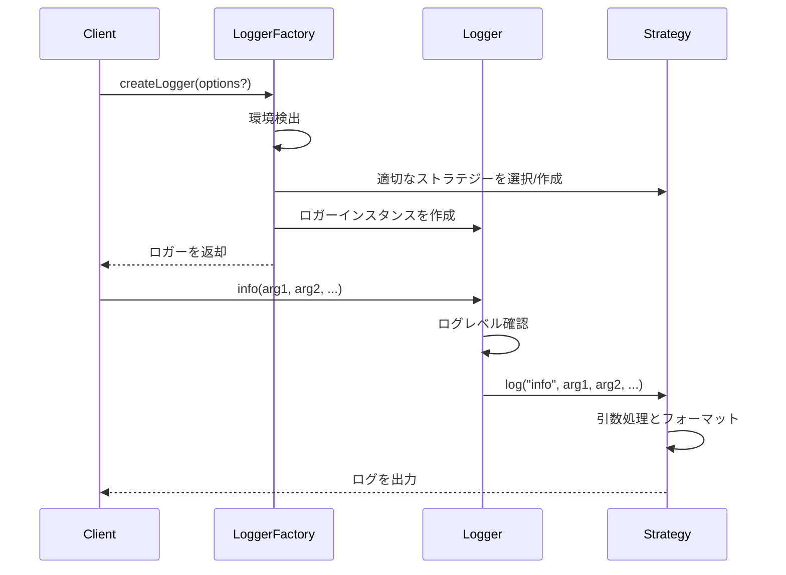

# Loggerモジュール設計書

## ユーザーの意図

loggerモジュールをsrc/logger以下に作成する。
既存の_/agent-core、_/code-sarge、_/ole-copipeを参考にして、汎用ライブラリの一部として使えるロギング機能を実装する。

要件：
- `createLogger`関数でロガーを作成できるようにする
- ログ出力先のストラテジーを注入できる設計にする
- 以下の3つのデフォルトストラテジーを提供する：
  - console出力（ブラウザ向け）
  - stderr出力（Node.js/Bun向け、stdout汚染を避ける）
  - JSONL形式出力（stdout, stderr, ファイルに出力可能）
- 環境に応じて適切なデフォルトストラテジーを自動選択する
  - ブラウザ環境 → consoleロガー
  - Node.js/Bun環境 → stderrロガー

## 現状

現在、プロジェクトには以下の構造がある：
- src/index.ts - メインエントリーポイント
- src/result/ - Result型を提供するモジュール

loggerモジュールはまだ存在しないため、新規に作成する必要がある。

## ゴール

以下の機能を持つloggerモジュールを実装する：

1. 複数のログレベル（debug, info, warn, error）をサポート
2. 拡張性のあるログ出力先ストラテジーパターンを実装
3. モジュール/コンポーネント名を指定してロガーを作成できる機能
4. 実行環境（ブラウザ/Node.js/Bun）に応じた適切なデフォルトストラテジーの自動選択
5. MCPサーバーと互換性のある設計（stdout汚染を避ける）
6. JSONL形式の構造化ログ出力をサポート
7. 引数の統一（messageパラメータを特別扱いせず、統一的に処理）
8. コーディングガイドラインに準拠した実装

## 用語集

- **Logger**: ログメッセージを記録するためのユーティリティ
- **LogLevel**: ログの重要度レベル（debug, info, warn, error）
- **LogStrategy**: ログの出力先と方法を定義するストラテジーパターン
- **ConsoleStrategy**: 標準的なconsoleオブジェクトを使用するストラテジー
- **StderrStrategy**: 標準エラー出力のみを使用するストラテジー（stdout汚染を避ける）
- **JsonlStrategy**: JSONL形式でログを出力するストラテジー
- **MCP (Model Context Protocol)**: AIモデルとの通信プロトコル
- **JSONL**: JSON Lines形式。各行が独立したJSON形式を持つテキストフォーマット

## 実装方針

### モジュール構成

```
src/
  logger/
    index.ts         - パブリックAPIのエクスポート
    types.ts         - 型定義
    core.ts          - ロガーのコア機能
    strategies/      - ログ出力戦略
      console.ts     - コンソール出力戦略
      stderr.ts      - 標準エラー出力戦略
      jsonl.ts       - JSONL形式出力戦略
      index.ts       - 戦略のエクスポート
    utils.ts         - ユーティリティ関数
```

### 主要なインターフェースと型

```typescript
// LogLevel型
export type LogLevel = 'debug' | 'info' | 'warn' | 'error';

// LogStrategyインターフェース
export interface LogStrategy {
  log(level: LogLevel, ...args: unknown[]): void;
}

// Loggerインターフェース
export interface Logger {
  debug(...args: unknown[]): void;
  info(...args: unknown[]): void;
  warn(...args: unknown[]): void;
  error(...args: unknown[]): void;
  
  // カスタマイズメソッド
  withContext(context: string): Logger;
}

// LoggerFactoryインターフェース
export interface LoggerFactoryOptions {
  strategy?: LogStrategy;
  minLevel?: LogLevel;
  defaultContext?: string;
}

// JsonlStrategyOptions
export interface JsonlStrategyOptions {
  // 出力先: 'stdout', 'stderr', または ファイルパス
  destination: 'stdout' | 'stderr' | string;
  // フォーマット関連のオプション
  formatOptions?: {
    includeTimestamp?: boolean;
    maxDepth?: number;
    maxArrayLength?: number;
  };
}

export interface LoggerFactory {
  createLogger(options?: LoggerFactoryOptions): Logger;
}
```

### 設計の詳細

1. **ファクトリーパターン**:
   - `createLogger`関数を通じてロガーインスタンスを作成
   - オプションでカスタムストラテジーを注入可能

2. **ストラテジーパターン**:
   - 複数のログ出力戦略（console, stderr, jsonl）をサポート
   - 環境に応じたデフォルトストラテジーの自動選択

3. **メソッドチェーン**:
   - `withContext`を使って新しいコンテキスト付きロガーを作成可能

4. **シングルトン**:
   - デフォルトロガーをシングルトンとして提供
   - 個別のロガーインスタンスも作成可能

5. **環境検出**:
   - 実行環境を自動検出してデフォルトのログ戦略を選択

6. **引数の統一処理**:
   - 全てのログメソッドが可変長引数(`...args`)を受け取る
   - 第一引数を特別扱いせず、全ての引数を統一的に処理

7. **JSONL形式ロギング**:
   - JSON Lines形式でログを出力
   - 複雑なオブジェクトも適切にフォーマット
   - 出力先としてstdout, stderr, ファイルを選択可能

### シーケンス図



## ユニットテスト

以下のテストケースを実装する：

1. **基本機能テスト**
   - 各ログレベルでメッセージが正しく出力されることを確認
   - ログレベルフィルタリングが正しく機能することを確認
   - 複数の引数が正しく処理されることを確認

2. **ストラテジーテスト**
   - ConsoleStrategyが正しく動作することを確認
   - StderrStrategyが正しく動作することを確認
   - JsonlStrategyが正しく動作することを確認
     - 出力先として stdout, stderr, ファイルの各ケースをテスト
     - 複雑なオブジェクトが正しくフォーマットされることを確認
   - カスタムストラテジーを注入できることを確認

3. **コンテキストテスト**
   - withContextで作成したロガーがコンテキスト情報を含めてログを出力することを確認

4. **環境検出テスト**
   - ブラウザ環境でConsoleStrategyが選択されることをモック環境で確認
   - Node/Bun環境でStderrStrategyが選択されることをモック環境で確認

## 結合テスト

1. **他のモジュールとの連携**
   - Resultモジュールと連携して、エラー情報をログ出力できることを確認

2. **実環境での動作確認**
   - ブラウザ環境とNode.js環境の両方で正しく動作することを確認
   - JSONL形式ログの出力が正しく動作することを確認

## 動作確認手順

1. `bun run typecheck` -> **Exit 0** を確認
2. `bun run test` -> **fail=0** を確認
3. `use_mcp_tool` code-sarge で、技術的負債を確認

### code-sarge

code-sargeで技術的負債の検知を行う：

```
<use_mcp_tool>
<server_name>code-sarge</server_name>
<tool_name>getStatus</tool_name>
<arguments>
{
  "runTests": true,
  "validateCode": true,
  "path": "."
}
</arguments>
</use_mcp_tool>
```

## 将来の拡張性

1. **ログローテーション機能**:
   - ファイル出力時のログローテーションをサポート

2. **カスタムフォーマッター**:
   - ログメッセージのフォーマットをカスタマイズする機能

3. **フィルタリング機能の強化**:
   - モジュール/コンポーネント別のログレベル設定をサポート
   - 特定のパターンに一致するログのみを出力する機能

4. **非同期ロギング機能の強化**:
   - バッファリングとバックグラウンド書き込みをサポート
   - 高パフォーマンス環境向けの最適化

5. **リモートロギング**:
   - ロギングサーバーへの送信をサポート

6. **ログの暗号化**:
   - 機密情報を含むログの暗号化をサポート