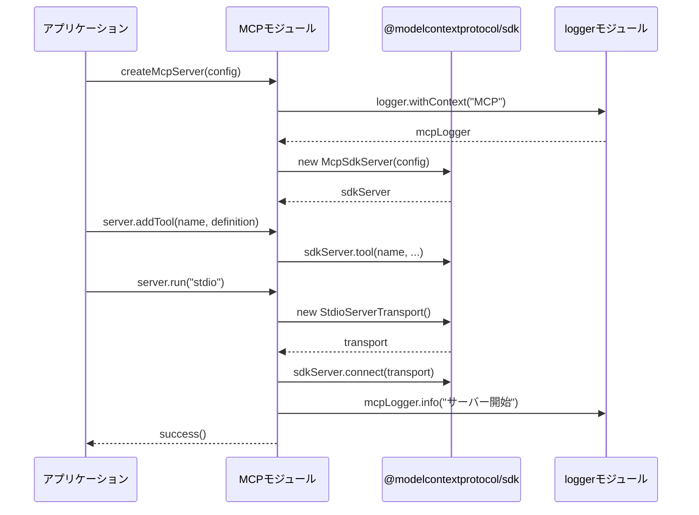
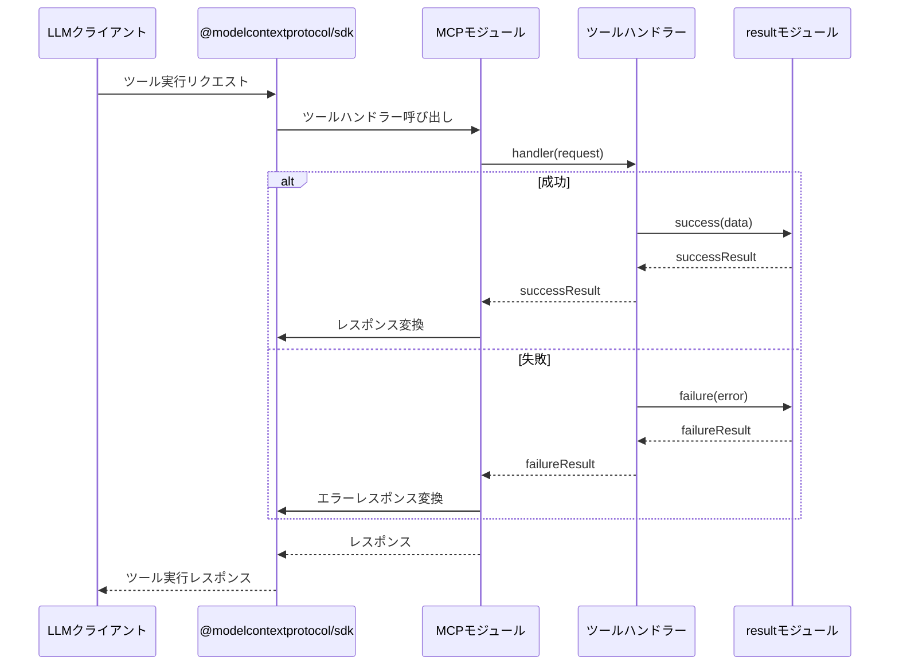

# MCP モジュール実装計画書

## ユーザーの意図

ユーザーは、libca汎用ライブラリ集の一部として、Model Context Protocol (MCP) 関連のコードを `src/mcp` に実装することを求めています。実装にあたっては、以下の要件があります：

1. _/agent-core、_/code-sarge、_/ole-copipeを参考にする
2. ole-copipeのMCP実装をベースとして使用する（実績があるため）
3. @modelcontextprotocol/sdkへの依存関係を追加する
4. 既存のlibcaモジュール（特にresultやlogger）と統合する

## 現状

現在のlibcaプロジェクトには、以下のモジュールが実装されています：

1. **result** - 例外を使わずに成功・失敗を表現するResult型とその操作関数を提供
2. **logger** - 拡張性のあるログ出力機能を提供（MCPサーバーとの互換性を考慮）
3. **retry** - 失敗した操作を設定可能なバックオフ戦略で再試行するための機能を提供

参考にすべき_/ole-copipe/packages/mcpには、以下の主要なファイルがあります：

1. **index.ts** - モジュールのエントリーポイント（型定義、関数のエクスポート）
2. **types.ts** - MCPサーバーの型定義
3. **server.ts** - MCPサーバーの基本実装
4. **client/** - クライアント関連の実装
5. **utils/** - ユーティリティ関数

これらのコードはole-copipe固有の機能を持ちながら、@modelcontextprotocol/sdkのラッパーとして機能しています。

## ゴール

以下の機能を持つ汎用的なMCPモジュールを実装します：

1. MCPサーバーの作成・設定・実行機能
2. ツール、リソース、プロンプトの定義と管理
3. クライアント接続管理とツール実行
4. エラーハンドリングとロギング連携
5. 拡張性を考慮した設計

全ての実装は、libcaのモジュール設計原則（単一責任、インターフェースベース設計、最小限の依存関係）に従い、コーディングガイドラインを厳守します。

## 用語集

- **MCP (Model Context Protocol)**: LLMモデルとツール間の標準インターフェースを定義するプロトコル
- **ツール (Tool)**: 特定の機能を提供する実行可能なコンポーネント
- **リソース (Resource)**: データや情報へのアクセスを提供するコンポーネント
- **プロンプト (Prompt)**: LLMに提供される指示や設定
- **トランスポート (Transport)**: クライアントとサーバー間の通信方式（stdio, SSE等）
- **ハンドラー (Handler)**: リクエストを処理し応答を返す関数
- **Result型**: 成功または失敗を表現する型（libcaのresultモジュールで提供）

## 実装方針

### 1. モジュール構成

```
src/mcp/
├── index.ts           # モジュールのエントリーポイント、パブリックAPI
├── types.ts           # 型定義
├── server.ts          # サーバー実装
├── client/
│   ├── index.ts       # クライアント機能のエントリーポイント
│   ├── connection.ts  # 接続管理
│   ├── manager.ts     # MCPマネージャー
│   ├── process.ts     # プロセス管理
│   ├── error.ts       # エラー定義
│   └── types.ts       # クライアント型定義
└── utils/
    ├── content-converter.ts  # コンテンツ変換ユーティリティ
    └── stdout-guard.ts       # 標準出力保護
```

### 2. 依存関係

- **外部依存**:
  - @modelcontextprotocol/sdk: MCP標準実装
  - zod: スキーマバリデーション

- **内部依存**:
  - result: エラーハンドリング
  - logger: ログ出力

### 3. インターフェース設計

各コンポーネントは明確なインターフェースを持ち、実装の詳細を隠蔽します：

```typescript
// サーバーインターフェース
export interface McpServer {
  run(transport: "stdio" | "sse"): Promise<Result<void, ErrorInfo>>;
  addTool(name: string, definition: ToolDefinition): void;
  addResource(uri: string, definition: ResourceDefinition): void;
  addPrompt(name: string, definition: PromptDefinition): void;
}

// クライアントインターフェース
export interface McpClient {
  connect(): Promise<Result<void, ErrorInfo>>;
  disconnect(): Promise<Result<void, ErrorInfo>>;
  callTool(name: string, args: Record<string, any>): Promise<Result<ToolResponse, ErrorInfo>>;
  accessResource(uri: string): Promise<Result<ResourceResponse, ErrorInfo>>;
}
```

### 4. エラーハンドリング

- libcaのresultモジュールを活用して、例外を使わないエラーハンドリングを実装
- 専用のエラー型を定義（McpErrorInfo）
- リトライ可能なエラーと不可能なエラーを区別

```typescript
// エラー型の例
export interface McpErrorInfo extends ErrorInfoBase {
  type: "mcp";
  kind: McpErrorKind;
  recoverable: boolean;
}

// エラー種別
export type McpErrorKind = 
  | "connection" 
  | "communication" 
  | "timeout" 
  | "parsing" 
  | "validation" 
  | "execution";
```

### 5. ロギング

- libcaのloggerモジュールを活用
- 適切なコンテキスト付きのログ出力
- デバッグ情報の提供

```typescript
// ロガー統合の例
const mcpLogger = logger.withContext("MCP");

// ログ出力例
mcpLogger.info(`サーバー開始: ${config.name} v${config.version}`);
mcpLogger.error(`ツール実行エラー: ${name}`, error);
```

## シーケンス図

### MCPサーバー起動シーケンス



### ツール実行シーケンス



## ユニットテスト

以下のテストケースを実装します：

1. **サーバー機能のテスト**
   - サーバー作成と設定のテスト
   - ツール、リソース、プロンプト追加のテスト
   - トランスポート選択のテスト

2. **クライアント機能のテスト**
   - 接続・切断のテスト
   - ツール実行のテスト
   - リソースアクセスのテスト
   - エラーハンドリングのテスト

3. **ユーティリティのテスト**
   - コンテンツ変換のテスト
   - stdout保護のテスト

テストコードは`src/mcp/*.test.ts`の形式で各ファイルと同じ場所に配置します。

## 結合テスト

以下の結合テストシナリオを実装します：

1. サーバーとクライアント間の通信テスト
2. 実際のツール実行とレスポンス処理テスト
3. エラー発生時の動作テスト
4. タイムアウト処理テスト

## 動作確認手順

1. `bun run typecheck` -> **Exit 0** を確認
2. `bun run test` -> **fail=0** を確認
3. `use_mcp_tool` code-sarge で、技術的負債を確認

### サーバー・クライアントの動作確認

1. テスト用のMCPサーバーを作成
2. サーバーを起動
3. クライアントから接続
4. サンプルツールを実行
5. 結果を確認

```typescript
// 動作確認用コード例
import { createMcpServer, createClient } from "./src/mcp";
import { success, isSuccess, unwrap } from "./src/result";

// サーバー作成
const server = createMcpServer({
  name: "test-server",
  version: "1.0.0"
});

// ツール追加
server.addTool("echo", {
  description: "入力をそのまま返す",
  inputSchema: {
    properties: {
      message: { type: "string", description: "エコーするメッセージ" }
    },
    required: ["message"]
  },
  handler: async (request) => {
    return success({ content: [{ type: "text", text: request.arguments.message }] });
  }
});

// サーバー起動
await server.run("stdio");

// クライアント作成と接続
const client = createClient("test-server");
const connectResult = await client.connect();

if (isSuccess(connectResult)) {
  // ツール実行
  const result = await client.callTool("echo", { message: "Hello, MCP!" });
  
  if (isSuccess(result)) {
    console.log("ツール実行結果:", unwrap(result));
  } else {
    console.error("ツール実行エラー:", result.error);
  }
  
  // 切断
  await client.disconnect();
}