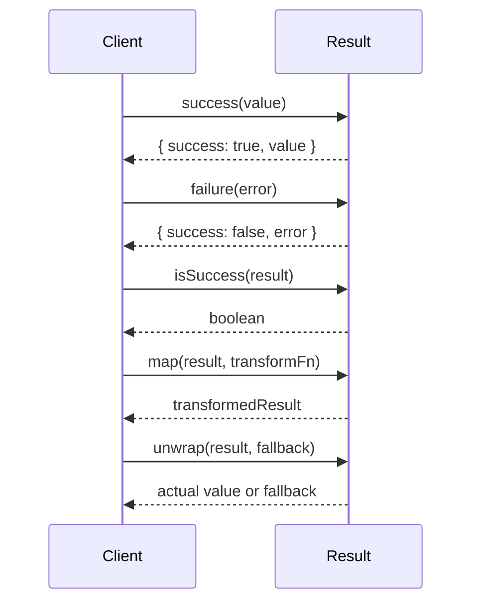

# Resultモジュール設計書 v1

## ユーザーの意図

コーディングガイドラインを遵守し、設計手順に従って`src/result`モジュールを作成する。このモジュールは、`_/agent-core`と`_/code-sarge`と`_/ole-copipe`を参考にした汎用ライブラリ集の一部となるものである。

## 現状

現在、プロジェクトには`result`モジュールは存在せず、これから新規に作成する必要がある。

参考となる実装として以下のコードがある：
- `_/agent-core/packages/core/src/utils/result-utils.ts` - Result型のユーティリティ関数
- `_/agent-core/packages/core/src/types/result.ts` - Result型の定義
- `_/ole-copipe/packages/common/src/result/types.ts` - Result型の定義
- `_/ole-copipe/packages/common/src/result/utils.ts` - Result型のユーティリティ関数
- `_/ole-copipe/packages/common/src/result/index.ts` - Result型のエクスポート

## ゴール

以下の要件を満たす`src/result`モジュールを作成する：

1. `Result<T, E>`型を提供し、成功時の値と失敗時のエラーを安全に扱えるようにする
2. Result型のユーティリティ関数（成功/失敗判定、値の取得、変換など）を提供する
3. コーディングガイドラインに沿った設計（SOLID原則、高凝集・低結合、型安全性など）を実現する
4. エラー情報を表現するための型と関数を提供する
5. モジュールとして独立していて、他のモジュールに依存しない
6. コードの重複を避け、再利用性の高い実装とする
7. すべての関数と型にTSDocを付与する

## 用語集

- **Result型**: 成功または失敗を表現する型。`Success<T>`または`Failure<E>`のいずれかの状態を持つ
- **Success**: 操作が成功したことを表し、成功時の値を含む
- **Failure**: 操作が失敗したことを表し、エラー情報を含む
- **ErrorInfo**: エラーの詳細情報を表す型
- **map関数**: Result型の値を別の値に変換する関数
- **flatMap関数**: Result型の値を別のResult型に変換する関数
- **unwrap関数**: Result型から値を取り出す関数

## 実装方針

モジュール構成：
- `src/result/index.ts`: モジュールのエントリーポイント、外部に公開するものをエクスポート
- `src/result/types.ts`: Result型に関連する型定義
- `src/result/utils.ts`: Result型に関連するユーティリティ関数
- `src/result/error.ts`: エラー関連の型と関数

モジュールのprivate prefixは`_result`とする。

### 型定義（types.ts）

```typescript
/**
 * result - リザルト型モジュール
 * 
 * このモジュールは、例外を使わずに成功・失敗を表現するResult型とその操作関数を提供します。
 * Result型を使うことで、関数が失敗する可能性を型情報として表現し、
 * コンパイル時に適切なエラーハンドリングを強制することができます。
 *
 * private prefix: `_result`
 */

/**
 * 成功または失敗を表すResult型
 * @template T 成功時の値の型
 * @template E 失敗時のエラーの型
 */
export type Result<T, E> = Success<T> | Failure<E>;

/**
 * 成功を表すSuccess型
 * @template T 成功時の値の型
 */
export interface Success<T> {
  /** 成功したことを表すフラグ */
  success: true;
  /** 成功時の値 */
  value: T;
}

/**
 * 失敗を表すFailure型
 * @template E 失敗時のエラーの型
 */
export interface Failure<E> {
  /** 成功しなかったことを表すフラグ */
  success: false;
  /** 失敗時のエラー情報 */
  error: E;
}

/**
 * エラー情報の基本インターフェース
 */
export interface ErrorInfoBase {
  /** エラーメッセージ */
  message: string;
  /** エラーが回復可能かどうか */
  recoverable: boolean;
  /** エラーの原因となったオリジナルのErrorオブジェクト（オプション） */
  cause?: Error | undefined;
  /** エラーのスタックトレース（オプション） */
  stack?: string | undefined;
}

/**
 * 拡張可能なエラー情報型
 * @template TType エラーの大分類
 * @template TCode エラーの小分類
 * @template TExtra 追加情報の型
 */
export type ErrorInfo<
  TType extends string,
  TCode extends string,
  TExtra extends object = {}
> = ErrorInfoBase & { type: TType; code: TCode } & TExtra;

/**
 * 一般的なエラー情報型
 */
export type GeneralErrorInfo = ErrorInfo<string, string>;
```

### ユーティリティ関数（utils.ts）

```typescript
import type { Result, Success, Failure } from "./types.ts";

/**
 * Resultが成功かどうかをチェックする型ガード
 * @template T 成功時の値の型
 * @template E 失敗時のエラーの型
 * @param result チェックするResult
 * @returns 成功の場合はtrue
 */
export function isSuccess<T, E>(result: Result<T, E>): result is Success<T>;

/**
 * Resultが失敗かどうかをチェックする型ガード
 * @template T 成功時の値の型
 * @template E 失敗時のエラーの型
 * @param result チェックするResult
 * @returns 失敗の場合はtrue
 */
export function isFailure<T, E>(result: Result<T, E>): result is Failure<E>;

/**
 * 成功のResultを作成する
 * @template T 成功時の値の型
 * @param value 成功時の値
 * @returns 成功のResult
 */
export function success<T>(value: T): Success<T>;

/**
 * 失敗のResultを作成する
 * @template E 失敗時のエラーの型
 * @param error 失敗時のエラー
 * @returns 失敗のResult
 */
export function failure<E>(error: E): Failure<E>;

/**
 * Resultから値を取り出す。失敗の場合はフォールバック値を返す
 * @template T 成功時の値の型
 * @template E 失敗時のエラーの型
 * @param result Result
 * @param fallback 失敗時に返すデフォルト値
 * @returns 成功時は結果の値、失敗時はフォールバック値
 */
export function unwrap<T, E>(result: Result<T, E>, fallback: T): T;

/**
 * Resultから値を取り出す。失敗の場合は例外をスローする
 * @template T 成功時の値の型
 * @template E 失敗時のエラーの型
 * @param result Result
 * @param errorTransformer エラーをErrorオブジェクトに変換する関数（オプション）
 * @returns 成功時の値
 * @throws 失敗時にはエラーが例外としてスローされる
 */
export function unwrapOrThrow<T, E>(
  result: Result<T, E>,
  errorTransformer?: (error: E) => Error
): T;

/**
 * Result内の値を変換する
 * @template T 元の成功時の値の型
 * @template U 変換後の成功時の値の型
 * @template E 失敗時のエラーの型
 * @param result 元のResult
 * @param fn 値を変換する関数
 * @returns 変換された値を含むResult
 */
export function map<T, U, E>(
  result: Result<T, E>,
  fn: (value: T) => U
): Result<U, E>;

/**
 * Result内の値を別のResultに変換する
 * @template T 元の成功時の値の型
 * @template U 変換後の成功時の値の型
 * @template E 失敗時のエラーの型
 * @param result 元のResult
 * @param fn 値を別のResultに変換する関数
 * @returns 変換された新しいResult
 */
export function flatMap<T, U, E>(
  result: Result<T, E>,
  fn: (value: T) => Result<U, E>
): Result<U, E>;

/**
 * Result内のエラーを変換する
 * @template T 成功時の値の型
 * @template E 元の失敗時のエラーの型
 * @template F 変換後の失敗時のエラーの型
 * @param result 元のResult
 * @param fn エラーを変換する関数
 * @returns エラーが変換されたResult
 */
export function mapError<T, E, F>(
  result: Result<T, E>,
  fn: (error: E) => F
): Result<T, F>;

/**
 * Result内の値を非同期に変換する
 * @template T 元の成功時の値の型
 * @template U 変換後の成功時の値の型
 * @template E 失敗時のエラーの型
 * @param result 元のResult
 * @param fn 値を非同期に変換する関数
 * @returns 非同期に変換された値を含むResultのPromise
 */
export function mapAsync<T, U, E>(
  result: Result<T, E>,
  fn: (value: T) => Promise<U>
): Promise<Result<U, E>>;

/**
 * Result内の値を非同期に別のResultに変換する
 * @template T 元の成功時の値の型
 * @template U 変換後の成功時の値の型
 * @template E 失敗時のエラーの型
 * @param result 元のResult
 * @param fn 値を非同期に別のResultに変換する関数
 * @returns 非同期に変換された新しいResultのPromise
 */
export function flatMapAsync<T, U, E>(
  result: Result<T, E>,
  fn: (value: T) => Promise<Result<U, E>>
): Promise<Result<U, E>>;

/**
 * 非同期関数の実行結果をResultでラップする
 * @template T 関数の戻り値の型
 * @template Args 関数の引数の型
 * @param fn 実行する非同期関数
 * @param args 関数に渡す引数
 * @returns 関数の実行結果をResultでラップしたPromise
 */
export function tryAsync<T, Args extends unknown[]>(
  fn: (...args: Args) => Promise<T>,
  ...args: Args
): Promise<Result<T, Error>>;

/**
 * 複数のResultを結合する。すべて成功した場合は値の配列、一つでも失敗した場合は最初の失敗を返す
 * @template T 成功時の値の型
 * @template E 失敗時のエラーの型
 * @param results Resultの配列
 * @returns すべて成功した場合は値の配列を含むSuccess、一つでも失敗した場合はその失敗
 */
export function all<T, E>(results: Result<T, E>[]): Result<T[], E>;
```

### エラー関連関数（error.ts）

```typescript
import type { ErrorInfo } from "./types.ts";

/**
 * バリデーションエラー情報
 */
export type ValidationErrorInfo = ErrorInfo<
  "validation",
  string,
  { field?: string }
>;

/**
 * システムエラー情報
 */
export type SystemErrorInfo = ErrorInfo<"system", string>;

/**
 * ネットワークエラー情報
 */
export type NetworkErrorInfo = ErrorInfo<
  "network",
  string,
  { url?: string }
>;

/**
 * HTTPエラー情報
 */
export type HttpErrorInfo = ErrorInfo<
  "http",
  string,
  { statusCode: number; url?: string }
>;

/**
 * データベースエラー情報
 */
export type DatabaseErrorInfo = ErrorInfo<
  "database",
  string,
  { operation?: string; table?: string }
>;

/**
 * I/Oエラー情報
 */
export type IOErrorInfo = ErrorInfo<
  "io",
  string,
  { path?: string; operation?: string }
>;

/**
 * エラー情報を作成する
 * @template TType エラーの大分類
 * @template TCode エラーの小分類
 * @template TExtra 追加情報の型
 * @param params エラー情報のパラメータ
 * @returns 作成されたエラー情報
 */
export function createErrorInfo<
  TType extends string,
  TCode extends string,
  TExtra extends object = {}
>(
  params: { type: TType; code: TCode; message: string; recoverable?: boolean } & TExtra
): ErrorInfo<TType, TCode, TExtra>;

/**
 * バリデーションエラーを作成する
 * @param message エラーメッセージ
 * @param field エラーが発生したフィールド名（オプション）
 * @returns バリデーションエラー情報
 */
export function createValidationError(
  message: string,
  field?: string
): ValidationErrorInfo;

/**
 * システムエラーを作成する
 * @param message エラーメッセージ
 * @param code エラーコード（オプション）
 * @returns システムエラー情報
 */
export function createSystemError(
  message: string,
  code?: string
): SystemErrorInfo;

/**
 * ネットワークエラーを作成する
 * @param message エラーメッセージ
 * @param url エラーが発生したURL（オプション）
 * @returns ネットワークエラー情報
 */
export function createNetworkError(
  message: string,
  url?: string
): NetworkErrorInfo;

/**
 * HTTPエラーを作成する
 * @param message エラーメッセージ
 * @param statusCode HTTPステータスコード
 * @param url エラーが発生したURL（オプション）
 * @returns HTTPエラー情報
 */
export function createHttpError(
  message: string,
  statusCode: number,
  url?: string
): HttpErrorInfo;

/**
 * データベースエラーを作成する
 * @param message エラーメッセージ
 * @param operation 実行していた操作（オプション）
 * @param table 対象テーブル名（オプション）
 * @returns データベースエラー情報
 */
export function createDatabaseError(
  message: string,
  operation?: string,
  table?: string
): DatabaseErrorInfo;

/**
 * I/Oエラーを作成する
 * @param message エラーメッセージ
 * @param path 操作対象のパス（オプション）
 * @param operation 実行していた操作（オプション）
 * @returns I/Oエラー情報
 */
export function createIOError(
  message: string,
  path?: string,
  operation?: string
): IOErrorInfo;
```

## シーケンス図

Result型の基本的な使用シーケンス



## ユニットテスト

Result型とユーティリティ関数のテスト計画：

### Result型の基本機能テスト
- `success`関数が正しくSuccess型を返すこと
- `failure`関数が正しくFailure型を返すこと
- `isSuccess`と`isFailure`の型ガードが正しく動作すること

### マッピング関数のテスト
- `map`関数が成功時に値を正しく変換すること
- `map`関数が失敗時にエラーをそのまま伝播すること
- `flatMap`関数が成功時に新しいResultを返すこと
- `flatMap`関数が失敗時にエラーをそのまま伝播すること

### エラー関連関数のテスト
- `mapError`関数がエラーを正しく変換すること
- `createErrorInfo`関数が正しくエラー情報を作成すること
- 各種具体的なエラー作成関数のテスト

### 非同期関数のテスト
- `mapAsync`、`flatMapAsync`が正しく動作すること
- `tryAsync`関数が非同期関数の結果を正しくResult型でラップすること

### 複合関数のテスト
- `all`関数がすべて成功の場合に正しく結果を配列にまとめること
- `all`関数がいずれか失敗の場合に最初の失敗を返すこと

## 動作確認手順

1. `bun run typecheck` -> **Exit 0** を確認
2. `bun run test` -> **fail=0** を確認
3. `use_mcp_tool` code-sarge で、技術的負債を確認

```
<use_mcp_tool>
<server_name>code-sarge</server_name>
<tool_name>getStatus</tool_name>
<arguments>
{
  "runTests": true,
  "validateCode": true,
  "path": "."
}
</arguments>
</use_mcp_tool>