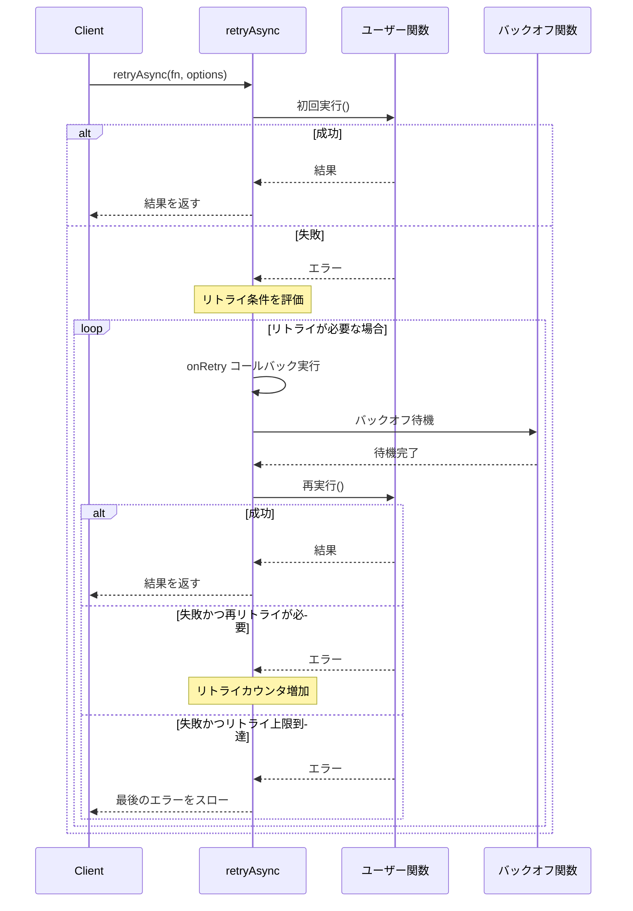
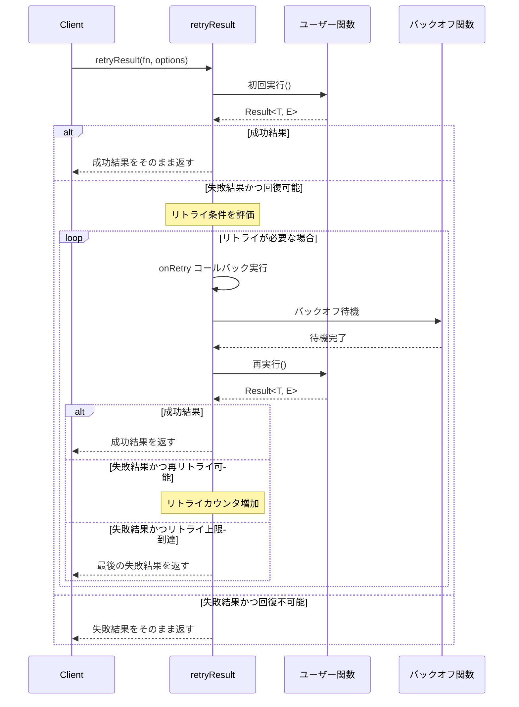

# リトライ・バックオフモジュール設計書 v1

## ユーザーの意図

コーディングガイドラインを遵守しながら、設計手順に従って汎用ライブラリlibcaの一部として、リトライ・バックオフ関連のモジュールを作成する。参考として_/agent-core、_/code-sarge、_/ole-copipeの既存のコードを見ることができる。

ユーザーは特に以下を希望している：
- バックオフ戦略は指数関数＋ジッター（乱数）をデフォルトとする
- 2種類のストラテジパターンを提供：
  1. 通常の関数に対するリトライ機能
  2. Result型を返す関数に対するリトライ機能（`error.recoverable=true`の場合のみリトライ）

## 現状

現在、libcaには以下のモジュールが実装されている：
- `result`: 例外を使わずに成功・失敗を表現するResult型とその操作関数
- `logger`: 拡張性のあるログ出力機能

リトライ・バックオフモジュールはまだ実装されていない。参考となる実装は、_/ole-copipeのディレクトリにあり、以下のファイルがある：
- `_/ole-copipe/packages/common/src/retry/backoff.ts`：バックオフ関数の実装
- `_/ole-copipe/packages/common/src/retry/retry-result.ts`：Result型用のリトライ処理
- `_/ole-copipe/packages/common/src/retry/policy.ts`：リトライポリシー定義

## ゴール

リトライとバックオフを管理するための汎用的なモジュールを実装する。これには、以下の要素が含まれる：

1. バックオフ戦略：リトライの間隔を指数関数的に増加させ、ジッターを加えることで同時リトライの集中を回避する
2. リトライ戦略：
   - 通常の関数（Promise含む）に対するリトライ
   - Result型を返す関数に対するリトライ（回復可能なエラーの場合のみ）
3. カスタマイズ可能な設定：
   - 最大リトライ回数
   - バックオフの基本単位時間
   - ジッターの割合
   - タイムアウト

## 用語集

- **バックオフ**：リトライ間の待機時間。サービスへの負荷を分散するために、通常は時間が経つにつれて待機時間を増加させる
- **指数バックオフ**：リトライごとに待機時間を指数関数的に増加させる戦略
- **ジッター**：リトライの同時実行を避けるために、待機時間にランダムな変動を加えること
- **リトライ戦略**：いつ、どのようにリトライを実行するかを決定するロジック
- **回復可能なエラー**：一時的な問題で、再試行によって解決できる可能性のあるエラー

## 実装方針

モジュール構造は以下の通り：

```
src/
  retry/
    index.ts        # パブリックAPI
    types.ts        # 型定義
    backoff.ts      # バックオフ戦略
    retry.ts        # 通常の関数用リトライ
    retry-result.ts # Result型関数用リトライ
    index.test.ts   # テスト
```

### パブリックAPI

```typescript
/**
 * retry - リトライ・バックオフモジュール
 * 
 * このモジュールは、失敗した操作を設定可能なバックオフ戦略で再試行するための機能を提供します。
 * 通常の関数とResult型を返す関数の両方をサポートし、様々なリトライシナリオに対応します。
 *
 * private prefix: `_retry`
 */

// types.ts からのエクスポート
export type {
  RetryOptions,
  BackoffOptions,
  RetryFunction,
  RetryResultFunction,
  RetryCondition,
} from "./types.ts";

// backoff.ts からのエクスポート
export {
  createBackoff,
  exponentialBackoffWithJitter,
  exponentialBackoff,
} from "./backoff.ts";

// retry.ts からのエクスポート
export {
  retry,
  retryAsync,
} from "./retry.ts";

// retry-result.ts からのエクスポート
export {
  retryResult,
} from "./retry-result.ts";
```

### 型定義（types.ts）

```typescript
/**
 * リトライ・バックオフモジュールの型定義
 */

// バックオフ関連の型
export interface BackoffOptions {
  /** ベース時間（ミリ秒） */
  baseMs?: number;
  /** 最大待機時間（ミリ秒） */
  maxMs?: number;
  /** ジッター係数（0～1） */ 
  jitterFactor?: number;
}

// バックオフ関数の型
export type BackoffFunction = (attempt: number) => Promise<void>;

// リトライ条件の型
export type RetryCondition<E = unknown> = (error: E, attempt: number) => boolean;

// 通常のリトライ用オプション
export interface RetryOptions<E = unknown> {
  /** 最大リトライ回数 */
  maxRetries: number;
  /** バックオフ関数 */
  backoff?: BackoffFunction;
  /** リトライ条件（エラーとリトライ回数から判断） */
  retryCondition?: RetryCondition<E>;
  /** 各リトライの前に呼ばれるコールバック */
  onRetry?: (attempt: number, error: E) => void;
}

// Result型リトライ用の関数型
export interface RetryResultOptions<E> extends RetryOptions<E> {
  // Result型特有のオプションがあれば追加
}
```

### バックオフ戦略（backoff.ts）

```typescript
/**
 * このファイルは、リトライ時のバックオフ戦略を定義します。
 */

import type { BackoffOptions, BackoffFunction } from "./types.ts";

/**
 * 指数バックオフを実装する関数（ジッター付き）
 *
 * @param options バックオフオプション
 * @returns 試行回数を受け取り、適切な待機時間を実現するPromiseを返す関数
 */
export const exponentialBackoffWithJitter = (options?: BackoffOptions): BackoffFunction => {
  const baseMs = options?.baseMs ?? 200;
  const maxMs = options?.maxMs ?? 8000;
  const jitterFactor = options?.jitterFactor ?? 0.2;
  
  return async (attempt: number): Promise<void> => {
    // 指数関数的に待機時間を増加させる（2のべき乗）
    const exponentialDelay = baseMs * Math.pow(2, attempt - 1);
    
    // 最大待機時間でクリップ
    const clippedDelay = Math.min(exponentialDelay, maxMs);
    
    // ジッターを追加（±jitterFactor%）
    const jitter = clippedDelay * jitterFactor * (Math.random() * 2 - 1);
    const finalDelay = Math.max(0, Math.floor(clippedDelay + jitter));
    
    // 待機処理
    await new Promise((resolve) => setTimeout(resolve, finalDelay));
  };
};

/**
 * 指数バックオフを実装する関数（ジッターなし）
 *
 * @param baseMs ベースとなるミリ秒（デフォルト: 200ms）
 * @returns 試行回数を受け取り、適切な待機時間を実現するPromiseを返す関数
 */
export const exponentialBackoff = (baseMs = 200): BackoffFunction => {
  return exponentialBackoffWithJitter({ baseMs, jitterFactor: 0 });
};

/**
 * バックオフ関数を作成
 *
 * @param options バックオフオプション
 * @returns バックオフ関数
 */
export const createBackoff = (options?: BackoffOptions): BackoffFunction => {
  return exponentialBackoffWithJitter(options);
};
```

### 通常関数用リトライ（retry.ts）

```typescript
/**
 * このファイルは、通常の関数（Promise関数を含む）をリトライするための機能を提供します。
 */

import type { RetryOptions, BackoffFunction } from "./types.ts";
import { exponentialBackoffWithJitter } from "./backoff.ts";

/**
 * 非同期関数をリトライする
 *
 * @param fn リトライする非同期関数
 * @param options リトライオプション
 * @returns 最終結果のPromise
 */
export async function retryAsync<T, E = Error>(
  fn: () => Promise<T>,
  options: RetryOptions<E>
): Promise<T> {
  const { 
    maxRetries, 
    backoff = exponentialBackoffWithJitter(),
    retryCondition = (error) => !!error,
    onRetry
  } = options;

  let attempts = 0;
  let lastError: any;

  while (true) {
    try {
      attempts++;
      return await fn();
    } catch (error) {
      lastError = error;

      // 最大リトライ回数を超えた、またはリトライ条件を満たさない場合は例外をスロー
      if (attempts > maxRetries || !retryCondition(error, attempts)) {
        throw error;
      }

      // リトライコールバック（設定されている場合）
      if (onRetry) {
        onRetry(attempts, error);
      }

      // バックオフ待機
      await backoff(attempts);
    }
  }
}

/**
 * 同期関数をリトライする
 *
 * @param fn リトライする同期関数
 * @param options リトライオプション
 * @returns 関数の結果
 */
export function retry<T, E = Error>(
  fn: () => T,
  options: RetryOptions<E>
): T {
  // 同期関数を非同期関数としてラップし、retryAsyncを利用
  return retryAsync(
    () => Promise.resolve().then(() => fn()),
    options
  );
}
```

### Result型関数用リトライ（retry-result.ts）

```typescript
/**
 * このファイルは、Result型を返す関数をリトライするための機能を提供します。
 */

import { isFailure, type Result, type ErrorInfo } from "../result/index.ts";
import type { RetryOptions, BackoffFunction } from "./types.ts";
import { exponentialBackoffWithJitter } from "./backoff.ts";

// 内部で使用する型定義
type AnyErrorInfo = ErrorInfo<string, string>;

/**
 * Result型を返す非同期関数をリトライする
 *
 * 失敗（isFailure）かつエラーが回復可能（error.recoverable === true）な場合のみリトライします。
 * リトライ回数が上限に達した場合や、回復不可能なエラーの場合は、最後の結果をそのまま返します。
 *
 * @param fn リトライする非同期関数
 * @param options リトライオプション
 * @returns 最終的なResult
 */
export async function retryResult<T, E extends AnyErrorInfo>(
  fn: () => Promise<Result<T, E>>,
  options: RetryOptions<E>
): Promise<Result<T, E>> {
  const { 
    maxRetries, 
    backoff = exponentialBackoffWithJitter(),
    // デフォルトのリトライ条件：失敗かつ回復可能なエラーの場合
    retryCondition = (error) => error.recoverable === true,
    onRetry
  } = options;

  // 初回実行
  let result = await fn();
  let attempts = 1;

  // 失敗かつリトライ条件を満たす場合、最大リトライ回数まで再試行
  while (
    isFailure(result) &&
    attempts <= maxRetries &&
    retryCondition(result.error, attempts)
  ) {
    // リトライコールバック（設定されている場合）
    if (onRetry) {
      onRetry(attempts, result.error);
    }

    // バックオフ処理（待機）
    await backoff(attempts);

    // 再試行
    result = await fn();
    attempts++;
  }

  // 最終結果を返す（成功または失敗）
  return result;
}
```

## シーケンス図

### 通常関数のリトライシーケンス



### Result型関数のリトライシーケンス



## ユニットテスト

以下のシナリオをテストします：

1. **バックオフ関数のテスト**
   - exponentialBackoffWithJitter関数が指定した範囲内の待機時間を生成するか
   - ジッター係数が正しく適用されるか

2. **通常関数リトライのテスト**
   - 成功する関数が正しく結果を返すか
   - 一時的に失敗する関数が最終的に成功するか
   - 最大リトライ回数に達した場合に例外をスローするか
   - リトライ条件に基づいて適切にリトライするか
   - onRetryコールバックが正しく呼ばれるか

3. **Result型関数リトライのテスト**
   - 成功するResult型関数が正しく結果を返すか
   - 一時的に失敗するResult型関数が最終的に成功するか
   - recoverable=trueのエラーのみリトライするか
   - 最大リトライ回数に達した場合に最後の失敗結果を返すか
   - カスタムretryConditionが正しく動作するか
   - onRetryコールバックが正しく呼ばれるか

## 動作確認手順

1. `bun run typecheck` -> **Exit 0** を確認
2. `bun run test` -> **fail=0** を確認
3. `use_mcp_tool` code-sarge で、技術的負債を確認

### テスト用のスクリプト

```typescript
if (import.meta.main) {
  const { success, failure, createSystemError } = await import("../result/index.ts");
  const { retry, retryAsync, retryResult } = await import("./index.ts");
  
  console.log("--- 通常関数のリトライデモ ---");
  let counter = 0;
  
  try {
    // 3回目で成功する関数
    const result = await retryAsync(
      async () => {
        counter++;
        console.log(`試行 ${counter}`);
        if (counter < 3) throw new Error(`一時的なエラー ${counter}`);
        return `成功: ${counter}回目`;
      },
      {
        maxRetries: 5,
        onRetry: (attempt, error) => console.log(`リトライ ${attempt}: ${error.message}`)
      }
    );
    
    console.log("結果:", result);
  } catch (error) {
    console.error("最終エラー:", error);
  }
  
  console.log("\n--- Result型のリトライデモ ---");
  counter = 0;
  
  // 3回目で成功するResult型関数
  const resultWithRetry = await retryResult(
    async () => {
      counter++;
      console.log(`試行 ${counter}`);
      
      if (counter < 3) {
        const error = createSystemError(`一時的なエラー ${counter}`);
        // recoverableをtrueに設定
        error.recoverable = true;
        return failure(error);
      }
      
      return success(`成功: ${counter}回目`);
    },
    {
      maxRetries: 5,
      onRetry: (attempt, error) => console.log(`リトライ ${attempt}: ${error.message}`)
    }
  );
  
  console.log("結果:", resultWithRetry);
}
```

以上がリトライ・バックオフモジュールの設計書です。このモジュールは汎用ライブラリlibcaの一部として、リトライと待機の機能を提供し、Result型と連携しながらも独立して使える設計になっています。