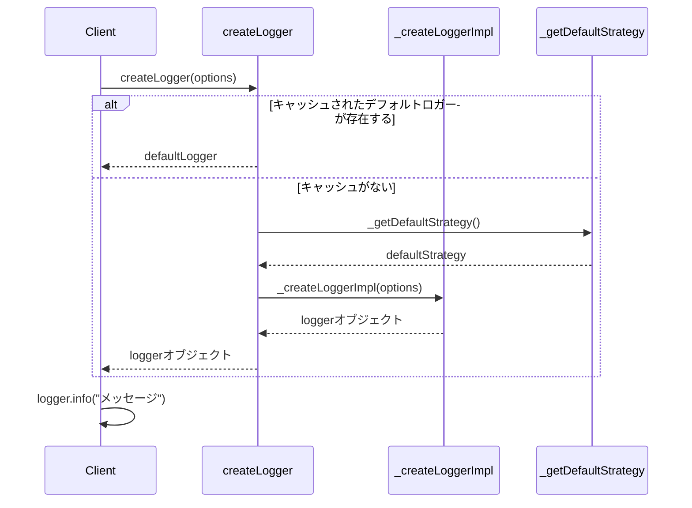
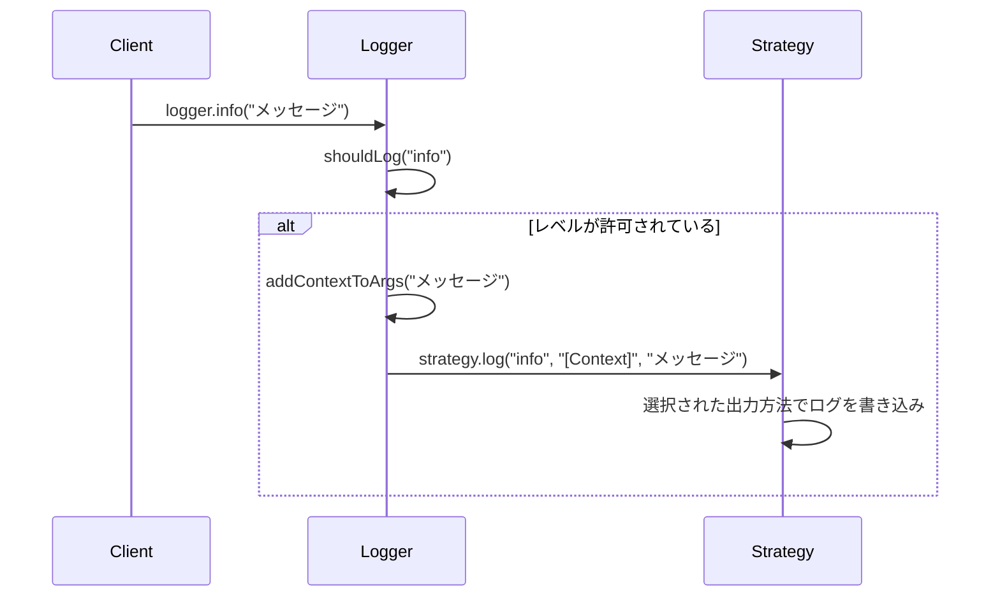

# Loggerモジュールのリファクタリング計画

## ユーザーの意図

src/loggerのコードを、classを使わないように書き直す。**後方互換性を用意することを絶対に禁じる**。

## 現状

現在のLoggerモジュールは以下の特徴を持つ：

- `_LoggerImpl` クラスを中心としたオブジェクト指向的な実装
- Factory パターンを使用してロガーインスタンスを作成
- Strategy パターンを使用して異なる出力方法（コンソール、標準エラー、JSONLファイル）をサポート
- ログレベルフィルタリング機能
- コンテキスト機能（サブロガーの作成）
- `core.ts` では完全にクラスベースで実装されている
- 各戦略も `ConsoleStrategy` などのクラスで実装されている

## ゴール

Loggerモジュールをクラスを使わない関数型アプローチでリファクタリングする：

- クロージャとファクトリ関数を使用してロガーの状態を保持
- 純粋関数を可能な限り活用
- イミュータブルなデータ構造の使用
- インターフェースは型定義のみで提供（実装クラスは使わない）
- 現在の機能（ログレベル、コンテキスト、カスタム戦略）はすべて維持
- **後方互換性は用意しない**

## 用語集

- **Logger**: ログを出力するためのインターフェース
- **LogLevel**: ログの重要度（debug, info, warn, error）
- **LogStrategy**: ログの出力方法を定義するインターフェース
- **クロージャ**: 関数が自身の外部のスコープにある変数を参照する機能
- **ファクトリ関数**: 他のオブジェクトを生成するための関数
- **カリー化**: 複数の引数を取る関数を、より少ない引数を取る関数の連鎖に変換する手法

## 実装方針

### 1. core.ts の変更

現在の `_LoggerImpl` クラスを、クロージャベースの実装に置き換える：

```typescript
// 変更前（クラスベース）
export class _LoggerImpl implements Logger {
  private readonly _strategy: LogStrategy;
  private readonly _minLevelPriority: number;
  private readonly _context?: string;
  
  constructor(options: LoggerOptions) {
    // ...
  }
  
  debug(...args: unknown[]): void {
    // ...
  }
  // ...他のメソッド
}

// 変更後（関数型）
export function _createLoggerImpl(options: LoggerOptions): Logger {
  const strategy = options.strategy ?? _getDefaultStrategy();
  const minLevelPriority = LOG_LEVEL_PRIORITY[options.minLevel ?? "debug"];
  const context = options.defaultContext;
  
  // クロージャを利用して内部状態を保持
  const shouldLog = (level: LogLevel): boolean => {
    return LOG_LEVEL_PRIORITY[level] >= minLevelPriority;
  };
  
  const addContextToArgs = (...args: unknown[]): unknown[] => {
    if (!context) return args;
    return [`[${context}]`, ...args];
  };
  
  // ロガーオブジェクトを返す（メソッドは関数として定義）
  return {
    debug(...args: unknown[]): void {
      if (shouldLog("debug")) {
        strategy.log("debug", ...addContextToArgs(...args));
      }
    },
    // ...他のメソッド
  };
}
```

### 2. ストラテジーの変更

各ストラテジークラスを、ファクトリ関数に置き換える：

```typescript
// 変更前（クラスベース）
export class ConsoleStrategy implements LogStrategy {
  log(level: LogLevel, ...args: unknown[]): void {
    // ...
  }
}

// 変更後（関数型）
export function _createConsoleStrategyImpl(): LogStrategy {
  return {
    log(level: LogLevel, ...args: unknown[]): void {
      // ...同じロジック
    }
  };
}
```

### 3. ファクトリ関数の変更

シングルトンパターンをクロージャに置き換える：

```typescript
// 変更前
export function createLoggerFactory() {
  let defaultLogger: Logger | null = null;
  
  return function createLogger(options: LoggerOptions = {}): Logger {
    // ...
    const logger = new _LoggerImpl(options);
    // ...
  };
}

// 変更後
export function createLoggerFactory() {
  let defaultLogger: Logger | null = null;
  
  return function createLogger(options: LoggerOptions = {}): Logger {
    // ...
    const logger = _createLoggerImpl(options);
    // ...
  };
}
```

## シーケンス図

### ロガーの作成と使用



### ログの出力



## ユニットテスト

既存のテスト（index.test.ts）をリファクタリング後の実装でもパスするようにする。
テストはロガーのインターフェースに対するものなので、内部実装の変更に影響されないはず。
ただし、classのスパイからオブジェクトのスパイに変更する必要がある場合もある。

## 動作確認手順

1. コードのリファクタリングを実施
2. `bun run typecheck` を実行 -> **Exit 0** を確認
3. `bun run test` を実行 -> **fail=0** を確認
4. code-sargeを使用して技術的負債がないことを確認

```
<use_mcp_tool>
<server_name>code-sarge</server_name>
<tool_name>getStatus</tool_name>
<arguments>
{
  "runTests": true,
  "validateCode": true,
  "path": "./src/logger/"
}
</arguments>
</use_mcp_tool>
```

## 注意点

1. クラスの削除に伴い、内部実装が大きく変わるが、最終的にエクスポートされるAPIの型は変わらないようにする
2. パフォーマンスに影響が出ないように注意する
3. すべてのテストが通ることを確認する