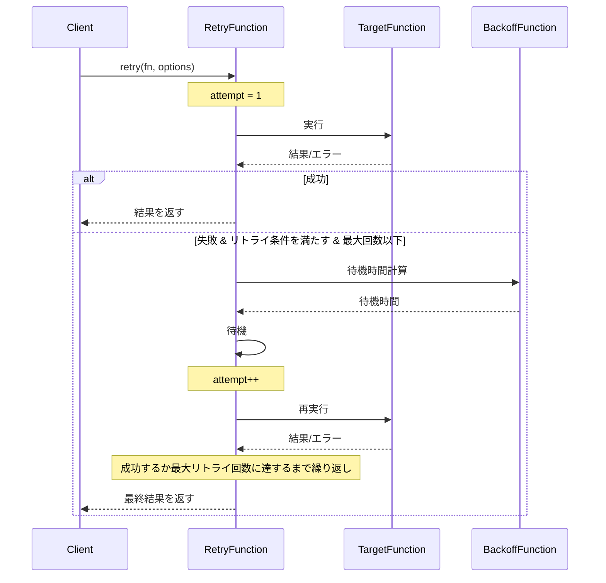

# リトライモジュールのリファクタリング設計書

## ユーザーの意図

1. src/retryのコードをclassを使わないように書き直す
2. **後方互換性を用意することを絶対に禁じる**
3. コーディングガイドラインを遵守した実装を行う

## 現状

現在のsrc/retryモジュールは以下のファイルで構成されています：

- `index.ts` - モジュールのエントリーポイント、公開API
- `types.ts` - 型定義
- `backoff.ts` - バックオフ関数の実装
- `retry.ts` - 通常関数のリトライ実装
- `retry-result.ts` - Result型を返す関数のリトライ実装
- 各種テストファイル

現在のコードは基本的に関数ベースでの実装ですが、以下の点が改善できます：

1. `interface` を使用した型定義がある（type エイリアスへの変更が可能）
2. リトライ処理の内部ロジックが命令的なスタイルで書かれている
3. オプションのデフォルト値の設定方法が複雑

## ゴール

1. classを完全に排除し、関数型プログラミングスタイルを採用する
2. interface から type への変更
3. よりシンプルで宣言的なコード構造
4. Result型の活用
5. 機能的に同等の動作を保ちながら、コードの品質を高める
6. **後方互換性は一切考慮しない**

## 用語集

- **バックオフ**: リトライ間の待機時間を決定する戦略
- **指数バックオフ**: リトライ回数に応じて指数関数的に待機時間を増加させる戦略
- **ジッター**: ランダムな変動を加えてタイミングをばらつかせる技術
- **リトライ条件**: リトライを続行するかどうかを決定する条件
- **Result型**: 成功または失敗のいずれかの状態を表現する型

## 実装方針

### 1. 型定義の変更（types.ts）

interfaceからtypeに変更し、型定義をよりシンプルにします。

```typescript
// 変更前
export interface BackoffOptions {
  baseMs?: number;
  maxMs?: number;
  jitterFactor?: number;
}

// 変更後
export type BackoffOptions = {
  readonly baseMs?: number;
  readonly maxMs?: number;
  readonly jitterFactor?: number;
};
```

### 2. バックオフ関数（backoff.ts）

現状でもすでに関数型実装ですが、より宣言的な形に整理します。

```typescript
// 現状はこのような形
export const exponentialBackoffWithJitter = (options?: BackoffOptions): BackoffFunction => {
  const baseMs = options?.baseMs ?? 200;
  const maxMs = options?.maxMs ?? 8000;
  const jitterFactor = options?.jitterFactor ?? 0.2;
  
  return async (attempt: number): Promise<void> => {
    // 命令的な実装...
  };
};

// より宣言的で関数型プログラミングらしい実装に変更
```

### 3. リトライ処理（retry.ts, retry-result.ts）

whileループを使った命令的な実装から、より宣言的でRecursiveな実装に変更します。

```typescript
// 変更前
export async function retryAsync<T, E = Error>(
  fn: () => Promise<T>,
  options: RetryOptions<E>
): Promise<T> {
  // whileループと状態変更を使った実装...
}

// 変更後 (イメージ)
export const retryAsync = async <T, E = Error>(
  fn: () => Promise<T>,
  options: RetryOptions<E>
): Promise<T> => {
  // より宣言的な再帰関数を使った実装...
};
```

### 4. Result型の活用

リトライ処理自体もResult型を返すように変更し、エラーハンドリングをより統一的に行います。

## シーケンス図

### リトライ処理のシーケンス



## ユニットテスト

既存のテストを修正して、新しい実装に対応させます。テストケースそのものは変更せず、API変更に合わせて構文を更新します。

1. `backoff.test.ts` - バックオフ関数のテスト
2. `retry.test.ts` - 通常関数リトライのテスト
3. `retry-result.test.ts` - Result型リトライのテスト

## 動作確認手順

1. `bun run typecheck` -> **Exit 0** を確認
2. `bun run test` -> **fail=0** を確認
3. `use_mcp_tool` code-sarge で、技術的負債を確認

```
<use_mcp_tool>
<server_name>code-sarge</server_name>
<tool_name>getStatus</tool_name>
<arguments>
{
  "runTests": true,
  "validateCode": true,
  "path": ".src/"
}
</arguments>
</use_mcp_tool>